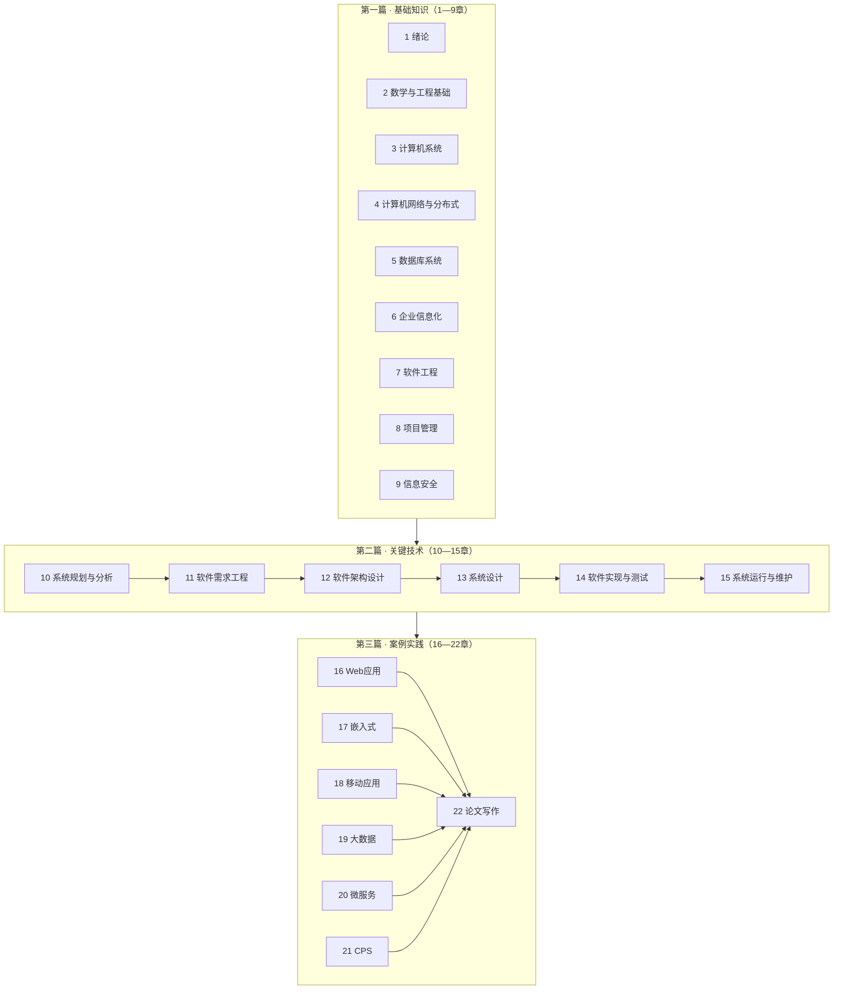

# 系统分析师知识点精炼 · 使用说明与知识地图

> 本套笔记依据《系统分析师教程（第2版）》22 章结构提炼，并对照**最新考试大纲**三科目范围组织。目标：支撑综合知识选择题、案例分析题、论文三科备考。

## 机考时间安排（2026 起 · 以准考证为准）

| 场次 | 科目 | 备考提示 |
|------|------|----------|
| **上午连考**（08:30 起） | **综合知识** → **案例分析** | 两科**同一场次连续机考**。先做 75 道单选（最长 **150 分钟**），**满 120 分钟可提前交卷**（比上限早 30 分钟），交卷后**立即进入案例分析**，不再单独下午场。 |
| **下午场**（通常 15:30 起） | **论文** | 4 选 1，摘要 + 正文，机考打字。 |

**复习节奏**：模考时练习「选择题控时 → 无缝切换案例七步法」整段上午链路；论文单独下午限时练笔。

## 组织与发布门禁（2026-09-10 起）

| 组织 | 路径 | 门禁 |
|------|------|------|
| 知识点编制委员会 → 审计委员会 | `docs/kb-workshop/` | **三名审计委员全员通过**方可正式发布精炼正文 |
| 出题细则审计委员会 | `docs/question-workshop/` | 细则全员通过后出题/评审才认正式稿 |
| 出题工坊 · 提示信息官 | `.cursor/skills/sysanalyst-hint-officer` | 检查习题**正确/错误提示**是否简洁、合理、通俗易懂 |
| 案例分析练习 | `content/banks/` + 站点「案例」 | 自编练习卡 + 真题入库 |
| 题库网站小组 | `docs/web-team/` | 站点设计与程序；正式内容未发布不得挂「正式」标签 |

口令示例：「召开知识点审计委员会」「编制委员会重编第X章」「提示信息官质检解析」「网站小组改版答题页」「案例分析入库」。

> **知识点精炼状态**：正式发布 **v1.1**（答卷化增强；审计委员会甲/乙/丙复审全员通过，2026-09-13）。  
> 规范见 `docs/kb-workshop/编制委员会/答卷写法准则-v1.1.md`；公告见 `docs/kb-workshop/审计委员会/正式发布/发布公告-v1.1.md`。  
> 前版 v1.0（2026-09-10）结构基线仍有效；P1/P2 章答卷化续批中。

---

## 一、目录结构说明

```
系统分析师知识点精炼/
├── 00-使用说明与知识地图.md                    ← 本文件
├── 第一篇-基础知识/
│   ├── 第一篇-第1至9章.md                 ← 分章目录索引
│   ├── 第01章-绪论.md … 第09章-信息安全.md
│   └── 附录-第一篇跨章高频对比速查.md
├── 第二篇-关键技术/
│   ├── 第二篇-第10至15章.md               ← 分章目录索引
│   ├── 第10章-系统规划与分析.md … 第15章-系统运行与维护.md
│   └── 附录-跨章综合速查.md
├── 第三篇-案例实践/
│   ├── 第三篇-第16至22章.md              ← 分章目录索引
│   ├── 第16章-Web应用系统分析与设计.md
│   ├── 第17章-嵌入式系统分析与设计.md
│   ├── 第18章-移动应用系统分析与设计.md
│   ├── 第19章-大数据处理系统分析与设计.md
│   ├── 第20章-微服务系统分析与设计.md
│   ├── 第21章-信息物理系统分析与设计.md
│   └── 第22章-系统分析师论文写作要点.md
├── 案例分析答题教程.md
├── 论文范文/                                      ← 论文练习范文（科目3）；入口 `论文范文/README.md`
└── 速查/
    ├── 大纲考点对照.md                          ← 大纲 ↔ 教程章节映射
    ├── 高频对比速查表.md                        ← 常考对比题速查
    ├── 近五年论文范围分析.md                    ← 论文命题趋势速查
    ├── 需求工程-体系化学习路径.md                ← 需求 L0→L4
    ├── UML-体系化学习指南.md                    ← UML 由简入深（补第7章概要）
    ├── Web与AI智能体-架构选型四维度卡.md        ← 2026 案例 Web+Agent 四维度对比
    └── 结构化与面向对象分析-体系化学习路径.md    ← SA+OOA L0→L4
```

**文件定位**（与教程三篇划分一致）：

| 篇 | 章节 | 主要服务科目 | 内容侧重 |
|----|------|-------------|----------|
| 第一篇 基础知识 | 1—9 | 科目1 综合知识 | 数学、计算机、网络、DB、企业信息化、软工、项目管理、信息安全 |
| 第二篇 关键技术 | 10—15 | 科目1 + 科目3 | 规划分析、需求、架构、设计、实现测试、运维 |
| 第三篇 案例实践 | 16—22 | 科目2 + 科目3 | Web/嵌入式/移动/大数据/微服务/CPS + 论文 |
| 速查 | — | 三科通用 | 大纲清单、对比表、复习路径 |

---

## 二、三篇 22 章知识地图

### 2.1 总览图



### 2.2 分章速查表

| 章 | 标题 | 核心关键词 | 科目 |
|----|------|-----------|------|
| 1 | 绪论 | 信息、系统、IS 工程、系统分析师角色 | 1 |
| 2 | 数学与工程基础 | 概率、图论、预测决策、建模、工程伦理 | 1 |
| 3 | 计算机系统 | 存储、Cache、I/O、RISC/CISC、OS、多处理机 | 1 |
| 4 | 计算机网络 | OSI/TCP-IP、子网、分布式、中间件、Web 服务、云 | 1 |
| 5 | 数据库 | 三级模式、范式、并发、备份、**分片/分片键·跨站点共享**、DW、挖掘、NoSQL | 1 |
| 6 | 企业信息化 | ERP/CRM/SCM、BPR、EAI、电子商务、政务 | 1 |
| 7 | 软件工程 | 生命周期、开发模型、RUP、敏捷、UML、CMM | 1 |
| 8 | 项目管理 | WBS、进度、成本、挣值、质量、风险、文档 | 1 |
| 9 | 信息安全 | 加密、防火墙、VPN、访问控制、容灾、可靠性 | 1 |
| 10 | 系统规划与分析 | 立项、可行性、DFD、成本效益、方案建议 | 1、3 |
| 11 | 需求工程 | 业务/用户/系统需求、获取、SRS、变更、跟踪 | 1、3 |
| 12 | 软件架构 | 架构风格、4+1、SOA、质量属性 | 1、3 |
| 13 | 系统设计 | 模块耦合内聚（含 RTSAD）、OO 设计、设计模式、UI | 1、3 |
| 14 | 实现与测试 | 黑盒白盒、测试阶段、部署 | 1、3 |
| 15 | 运行维护 | 维护类型、转换策略、遗留系统 | 1、3 |
| 16 | Web 应用 | B/S、MVC、微服务、缓存、Web 测试 | 2、3 |
| 17 | 嵌入式 | RTOS、调度、优先级反转、低功耗 | 2 |
| 18 | 移动应用 | Native/Hybrid/小程序、MVVM、无代码 | 2 |
| 19 | 大数据 | Lambda、Hadoop、实时/离线、数据安全 | 2、3 |
| 20 | 微服务 | 容器、注册发现、OAuth2、架构模式 | 2、3 |
| 21 | CPS | 感知-决策-执行、工业协议、SoS | 2、3 |
| 22 | 论文 | 结构、摘要、评分、常见问题 | 3 |

---

## 三、建议复习路径

### 3.1 按科目

#### 科目1：综合知识（75 分 / 75 题，单选）

**目标**：广度覆盖 + 对比辨析

| 阶段 | 时间建议 | 内容 | 资料 |
|------|----------|------|------|
| 第一轮 | 4—6 周 | 按 1→15 章顺序通读第一篇+第二篇 | 各章精炼 + 速查对比表 |
| 第二轮 | 2—3 周 | 薄弱章重读 + 大纲考点对照逐项勾选 | 大纲考点对照.md |
| 第三轮 | 1—2 周 | 真题/模拟题 + 错题回查 | 高频对比速查表 |

**高频块**（占分权重大，优先保证）：
- 第3章 存储/Cache/OS
- 第4章 网络/子网/云计算
- 第5章 范式/并发/备份/DW
- 第6章 ERP/BPR/EAI
- 第7章 开发模型/CMM
- 第8章 挣值/WBS
- 第9章 加密/访问控制/容灾
- **第11章 需求工程**（可用刷题路径「需求工程 L0→L4」+ 速查《需求工程-体系化学习路径》；SA/OOA 专精路径「结构化与OO分析 L0→L4」+ 速查《结构化与面向对象分析-体系化学习路径》）
- 第12章 架构风格/SOA

#### 科目2：案例分析（75 分，3 道大题）

**目标**：第三篇领域知识 + 第二篇方法落地

| 阶段 | 内容 |
|------|------|
| 基础 | 第10—15章（可行性、需求、架构、测试） |
| 核心 | 第16—21章（六领域各准备 1 套「场景-架构-开发-测试-关联」模板） |
| 冲刺 | 历年真题：EAI/SOA 对比、架构选型、测试方案、协议选型 |

**案例答题四步法**：
1. **审题**：圈关键词（实时？高并发？遗留系统？）
2. **定位**：对应章节（Web/嵌入式/…）
3. **对比**：至少 2 方案列表格（优缺点）
4. **落地**：测试、安全、运维、与综合知识勾连

#### 科目3：论文（75 分，4 选 1，≥2000 字）

**目标**：1 个项目素材 + 多主题复用

| 阶段 | 内容 |
|------|------|
| 准备 | 选定近 3 年项目，写 800 字项目概要（可复用） |
| 精读 | 第22章全文 + 第二篇方法章（10—15） |
| 练笔 | 按三问结构限时 120 分钟写 2—3 篇 |
| 素材库 | 每个常考主题准备 2—3 个深入技术点 |

**论文主题与大章对应**：见第三篇第22章末表 + 速查/大纲考点对照.md 科目3部分。

### 3.2 按时间（距考试 8 周示例）

```
周1—2：第一篇 1—4章 + 速查对比（开发模型、RAID、架构风格）
周3—4：第一篇 5—8章 + 第二篇 10—11章
周5—6：第二篇 12—15章 + 第三篇 16—20章
周7：  第三篇 21—22章 + 案例真题 2 套
周8：  综合模拟 + 论文限时 1 篇 + 查漏补缺（大纲对照勾选）
```

### 3.3 按基础

| 背景 | 建议 |
|------|------|
| 有项目管理/开发经验 | 先第三篇案例 + 第22章论文，再补第一篇薄弱章 |
| 在校学生/经验少 | 先第一篇+第二篇打基础，论文多读范文+虚构合理项目细节 |
| 二战/部分通过 | 未过科目精读 + 大纲对照补漏；已过科目用速查维持 |

---

## 四、如何用本套笔记做题

### 4.1 综合知识选择题

1. **看到概念题** → 回对应章精炼「定义/特点」段
2. **看到对比题** → 先查 `速查/高频对比速查表.md`
3. **看到计算题** → 第2章（图论/决策）、第8章（挣值/COCOMO）、第3章（Cache/子网）
4. **看到英文题** → 记各章英文缩写（RAID、RUP、SOA、CPS…）

### 4.2 案例分析题

1. **读题干领域** → 打开第三篇对应章「场景特征」
2. **问架构/方案** → 「架构原则/模式」+ 对比表
3. **问开发/测试** → 「开发与测试要点」
4. **问与 XX 关系** → 「与综合知识关联」回查第一篇/第二篇

**常考题型映射**：

| 题型 | 查阅位置 |
|------|----------|
| EAI vs SOA/ESB | 第6章 EAI + 第20章微服务 + 对比速查表 |
| 架构选型 | 第12章风格 + 第16/20章 + 对比速查表 |
| 测试方案 | 第14章 + 第16/19/20章测试节 |
| 调度/实时 | 第17章 + 对比速查表 |
| 大数据 pipeline | 第19章 + 第5章 DW |

### 4.3 论文题

1. **选题** → 选与准备项目最接近的；优先有深度素材的
2. **拆题** → 试题 3 问 = 正文 3 大块（概要 / 理论 / 实践）
3. **写摘要** → 第22章模板，300—400 字，含项目+角色+主题+措施
4. **写正文** → 项目概要 400—600 字 → 理论 800—1200 → 实践 400—500 → 总结
5. **自检** → 第22章「常见问题」+ 评分五维度

### 4.4 复习检查清单

- [ ] 大纲考点对照.md 科目1 各节已勾选
- [ ] 高频对比速查表能闭卷说出 80% 条目
- [ ] 第三篇六领域各能画 1 张架构简图
- [ ] 论文项目概要已写好并可默写
- [ ] 限时完成 1 套综合 + 1 道案例 + 1 篇论文

---

## 五、与其他资料配合

| 资料 | 配合方式 |
|------|----------|
| 官方教程 | 本笔记为提炼；疑难回查原文 |
| 考试大纲 | 以 `速查/大纲考点对照.md` 为检核清单 |
| 历年真题 | 做题后回笔记补漏，错题标章节 |
| 英语词汇 | 各章英文缩写汇总（综合知识第18部分） |

---

## 六、说明

- 本套笔记为**提炼归纳**，非教程原文；具体公式、数值以教程和大纲为准。
- 第三篇第16—21章为科目2直接范围；第22章为科目3写作指南。
- 大纲中「开源软件」「标准化」「经济管理」「专业英语」等在教程中分散或未单独成章，复习时结合大纲考点对照补读教程相关段落。

---

*祝备考顺利。*
