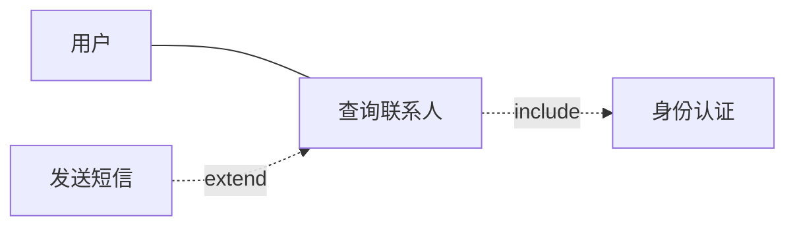
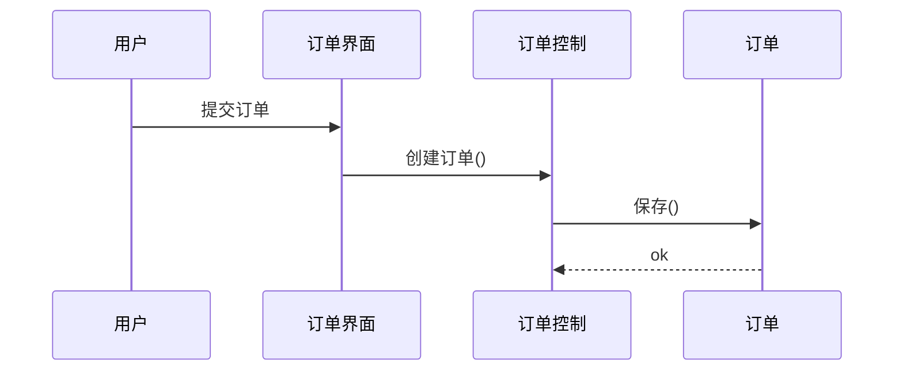

# 速查 · UML 体系化学习指南（由简入深）

> **对齐**：大纲 §5.7 统一建模语言 UML（教程第7章）+ 面向对象分析用例（第11章）  
> **规范依据**：OMG UML 2.5.1（结构 / 行为图分类、关系语义）  
> **本站旧稿**：第7章仅列图种与关系名；第11章仅有用例模型要点——本指南在其上补全「读法、画法、易混、案例填空」  
> **读者画像**：前端向、弱数学；重语义与答题套路，少形式化

---

## 0. 怎么用（15 分钟地图）

| 关卡 | 目标 | 建议用时 | 过关标准 |
|------|------|----------|----------|
| **L0 入门** | UML 是什么、两类图、考试考什么 | 20 分钟 | 能说「结构看静态、行为看动态」 |
| **L1 积木** | 事物 / 关系 / 图种总表 | 30 分钟 | 闭卷写出 5 种关系 + 5 种必考图 |
| **L2 必考五图** | 用例 / 类 / 序列 / 状态 / 活动 | 2–3 小时 | 见题干能选对图、会填空 |
| **L3 加深** | 聚合组合、include/extend、包/组件/部署 | 1 小时 | 易混对比不翻车 |
| **L4 应试** | 案例填空套路、4+1、OOA→OOD | 45 分钟 | 真题卷能限时开做 |

**推荐节奏**

1. 先扫 L0–L1 → 再精读 L2 五图（案例主战场）  
2. 对照本站真题：案例分析 → 题库「真题」筛含 UML/用例/状态/序列的题  
3. 回第7章「UML（概要）」做 30 秒回忆；细节以本指南为准

**终局口诀**

> 看清**谁**（参与者/对象）→ 看清**什么结构**（类/关系）→ 看清**怎么交互/变状态**（序列/状态/活动）→ 空白处回扣题干名词。

---

## 1. L0 · 入门：先立坐标系

### 1.1 UML 是什么

**UML（Unified Modeling Language，统一建模语言）** 是 OMG 维护的**可视化建模语言**：用标准图形符号描述软件系统的结构与行为，服务「可视化、规约、构造、文档化」。

它**不是**编程语言，也**不是**开发过程（RUP 等过程可选用 UML）。

### 1.2 两大语义区（UML 2.x）

| 类别 | 回答的问题 | 考试关键词 |
|------|------------|------------|
| **结构图 Structure** | 系统由哪些零件组成？零件如何连接？ | 类、对象、包、组件、部署 |
| **行为图 Behavior** | 系统如何运作、交互、换状态？ | 用例、序列、活动、状态机 |

### 1.3 软考里通常考什么

| 科目 | 常见考法 |
|------|----------|
| 综合知识 | 图种辨认、关系辨析（关联/聚合/组合、include/extend）、RUP+UML |
| 案例分析 | **补全图**（用例名、类名、消息、状态迁移、活动步骤）、选图种 |
| 论文 | 可写「用 UML 做需求分析/架构视图」，一般不考符号细节 |

**必考优先级（由高到低）**：用例图 → 类图 → 序列图 → 状态图 → 活动图 → 组件/部署图。

---

## 2. L1 · 积木：事物、关系、图种

### 2.1 三类「积木」（教材常见三分法）

| 积木 | 含义 | 例子 |
|------|------|------|
| **事物 Things** | 模型里的「名词」 | 类、接口、用例、状态、组件、节点 |
| **关系 Relationships** | 事物之间怎么连 | 关联、依赖、泛化、实现、聚合、组合 |
| **图 Diagrams** | 积木的投影视图 | 下面总表 |

### 2.2 UML 2.5.1 图种总表（规范口径）

**结构图**

| 图 | 一句话 | 软考热度 |
|----|--------|----------|
| 类图 Class | 类、属性、操作、关系 | ★★★★★ |
| 对象图 Object | 某一时刻的对象实例 | ★ |
| 包图 Package | 命名空间 / 模块分组 | ★★ |
| 组件图 Component | 可替换的实现单元与接口 | ★★★ |
| 组合结构图 Composite Structure | 类内部零件与连接器 | ★（少考） |
| 部署图 Deployment | 软件制品如何落到节点上 | ★★★ |
| 剖面图 Profile | 扩展 UML 元模型 | 几乎不考 |

**行为图**

| 图 | 一句话 | 软考热度 |
|----|--------|----------|
| 用例图 Use Case | 谁用系统、做什么业务价值 | ★★★★★ |
| 活动图 Activity | 流程、并行、分支（像高级流程图） | ★★★★ |
| 状态机图 State Machine | **一个对象**生命周期内的状态迁移 | ★★★★ |
| 序列图 Sequence | 对象间消息的时间顺序 | ★★★★★ |
| 通信图 Communication | 同交互，强调链接而非时间轴 | ★★ |
| 定时图 Timing | 时间约束下的状态/值变化 | ★ |
| 交互概览图 Interaction Overview | 活动图框里嵌交互 | ★ |

> 旧称「顺序图」≈ 序列图；「协作图」在 UML 2 中由通信图等承接。答题写「序列图/顺序图」一般均可。

### 2.3 关系速记（先背这张）

| 关系 | 符号印象 | 语义 | 口诀 |
|------|----------|------|------|
| **关联 Association** | 实线 | 对象间可导航的结构性连接 | 「认识」 |
| **依赖 Dependency** | 虚线箭头 | 一方变化可能影响另一方（常短暂） | 「用一下」 |
| **泛化 Generalization** | 空心三角实线 | 一般←特殊（继承） | 「是一种」 |
| **实现 Realization** | 空心三角虚线 | 类实现接口 / 组件实现接口 | 「兑现契约」 |
| **聚合 Aggregation** | 空心菱形 | 整体–部分，部分可独立存活 | 「有一些」 |
| **组合 Composition** | 实心菱形 | 强整体–部分，部分随整体消亡 | 「长在身上」 |

菱形画在**整体**一侧。

---

## 3. L2 · 必考五图（精读）

### 3.1 用例图 Use Case Diagram

**回答**：系统边界外有谁（参与者），要完成哪些有价值的目标（用例）。

#### 元素

| 元素 | 画法要点 | 注意 |
|------|----------|------|
| **系统边界** | 方框 + 系统名 | 边界外是参与者，内是用例 |
| **参与者 Actor** | 小人或立体角色 | 可以是人、外部系统、硬件、时钟 |
| **用例 Use Case** | 椭圆 + 动宾名 | 「查询订单」✓ 「订单管理界面」✗ |
| **关联** | 参与者—用例实线 | 表示通信；箭头可标主动发起方 |
| **\include** | 虚线箭头「≪include≫」指向被包含用例 | **基用例总是需要**这段公共行为 |
| **\extend** | 虚线箭头「≪extend≫」指向**基用例** | **可选/条件**扩展；箭头方向易反 |
| **泛化** | 用例或参与者之间的空心三角 | 特殊用例/角色继承一般者 |

#### include vs extend（必背）

| | include | extend |
|--|---------|--------|
| 何时发生 | 基用例**每次**都执行被包含部分 | 仅在条件满足时 |
| 箭头方向 | 基 → 被包含 | 扩展 → 基 |
| 考试话术 | 抽取公共子流程 | 可选增值/异常分支 |

#### 与第11章衔接

构建四阶段：**识别参与者 → 合并需求得用例 → 细化规约 → 调整模型**。  
规约要有：主/备选事件流、前置/后置条件、非功能。

#### 案例填空套路

1. 空白在边界外 → 多半是**参与者**（回扣题干角色名）  
2. 空白在椭圆 → **用例名**（动宾，对齐题干业务动词）  
3. 虚线 + include/extend → 先判断「必经还是可选」再定关系与箭头



---

### 3.2 类图 Class Diagram

**回答**：系统有哪些概念/设计类，属性与操作是什么，类之间如何关联。

#### 类盒子三格（可省略）

```
┌─────────────┐
│  类名       │
├─────────────┤
│ 属性        │
├─────────────┤
│ 操作()      │
└─────────────┘
```

可见性：`+` public · `-` private · `#` protected · `~` package

#### 分析类三角色（案例高频）

| 类型 | 职责 | 题干线索 |
|------|------|----------|
| **边界/界面 Boundary** | 与参与者交互的接口 | 页面、API 网关、窗口 |
| **控制 Control** | 协调用例流程 | 「处理订单」「调度」 |
| **实体 Entity** | 持久业务数据 | 订单、用户、商品 |

口诀：**界面收发、控制编排、实体存业务。**

#### 多重性 Multiplicity

常见写法：`1`、`0..1`、`*` 或 `0..*`、`1..*`。  
读法：靠近对方类那一端的数字 = 「一个本端对象对应几个对端」。

#### 案例填空套路

1. 空在类名 → 用题干名词（订单、车辆、缓冲区）  
2. 空在关系线 → 先定关联/聚合/组合/泛化  
3. 空在多重性 → 看「一个 A 有几个 B」的业务句  
4. 问「缺哪些类」→ 优先补全 边界/控制/实体 三角

---

### 3.3 序列图 Sequence Diagram

**回答**：完成某场景时，对象之间**按时间先后**发了哪些消息。

#### 元素

| 元素 | 含义 |
|------|------|
| **生命线** | 竖虚线 = 对象在时间上的存在 |
| **激活条** | 窄竖条 = 对象正在执行 |
| **同步消息** | 实心箭头实线；调用方等待 |
| **异步消息** | 通常开放箭头；不阻塞 |
| **返回** | 虚线箭头（可省略） |
| **组合片段** | `alt` 分支 · `opt` 可选 · `loop` 循环 · `par` 并行 |

时间**从上往下**流逝；左右是对象。

#### 和通信图的差别

| | 序列图 | 通信图 |
|--|--------|--------|
| 强调 | 时间顺序 | 对象间链接结构 |
| 消息编号 | 可按序 | 常用 1、1.1、2 编号 |

#### 案例填空套路

1. 空在生命线顶部 → **对象/类角色名**  
2. 空在水平箭头 → **消息名**（动词，对齐用例步骤）  
3. 问「下一步」→ 沿时间轴往下读题干流程



---

### 3.4 状态机图 State Machine Diagram

**回答**：**某一个对象**在生命周期中有哪些状态，事件如何触发迁移。

#### 元素

| 元素 | 画法 |
|------|------|
| 初态 | 实心圆 |
| 终态 | 牛眼（双圆内实心） |
| 状态 | 圆角矩形 |
| 迁移 | 箭头：`事件[条件]/动作` |
| 复合状态 | 大框内嵌子状态 |

**状态内活动**：`entry/` 进入时 · `do/` 在状态中 · `exit/` 离开时。

#### 与活动图怎么选

| 用状态图 | 用活动图 |
|----------|----------|
| 焦点是**一个对象**的状态（订单：待支付→已支付→已发货） | 焦点是**业务流程**步骤与并行 |
| 「处于什么状态」 | 「下一步做什么」 |

#### 案例填空套路

1. 空在圆角框 → 状态名（题干里的阶段名词）  
2. 空在箭头旁 → 事件/条件（点击支付、超时取消）  
3. 初态指出发业务；终态对「完成/取消」等收尾

---

### 3.5 活动图 Activity Diagram

**回答**：业务或算法如何一步步推进，哪里分支、合并、并行。

#### 元素（UML 2 活动语义）

| 元素 | 含义 |
|------|------|
| 初始/终结节点 | 实心圆 / 牛眼 |
| 动作 Action | 圆角矩形 |
| 决策/合并 | 菱形 |
| 分叉/汇合 Fork/Join | 粗横线或竖线（并行） |
| 泳道/分区 Partition | 按职责/角色分列 |
| 对象节 | 可表示数据对象流转 |

#### 与传统流程图三区别（常考表述）

1. 可表达**并行**（分叉/汇合）  
2. 可表达**对象流**与活动分区（泳道）  
3. 语义基于**令牌 token**（UML 2），不止「画箭头」

#### 案例填空套路

空白多半是**动作名**或**泳道角色**；并行处找「同时进行」的题干句。

---

## 4. L3 · 加深：易混与次高频图

### 4.1 聚合 vs 组合（送分也易错）

| | 聚合 | 组合 |
|--|------|------|
| 菱形 | 空心 | 实心 |
| 生命周期 | 部分可脱离整体独立存在 | 部分强依赖整体；整体删则部分删 |
| 例子 | 车队—车辆（车可换队） | 订单—订单行；人体—心脏（题面常如此类比） |

判据：**部分能否单独存在、是否同生共死**。

### 4.2 关联 vs 依赖

- **关联**：结构性、通常较长生命周期（成员变量级「有一个」）  
- **依赖**：使用关系、临时（方法参数、局部变量、调用工具类）

### 4.3 泛化 vs 实现

- **泛化**：类与类 / 接口与接口，「子是父的一种」  
- **实现**：类 → 接口，「类兑现接口承诺」

### 4.4 包图 Package

- 用途：分层（表现层/业务层/数据层）、子系统边界、控制依赖方向  
- 依赖箭头：被用方 ← 使用方（虚线）

### 4.5 组件图 Component

- **组件**：可替换的实现块，通过**提供接口 / 需求接口**连接  
- 考试：画清「谁提供服务、谁需要服务」

### 4.6 部署图 Deployment

- **节点 Node**：运行时计算资源（服务器、设备）  
- **制品 Artifact**：可部署的文件/包  
- 关系：制品「部署到」节点上  
- Web/微服务案例常考：浏览器、网关、应用服务器、DB、缓存节点

### 4.7 对象图

某时刻一组对象实例及链接——可理解为类图的「运行时快照」。综合知识偶考概念。

---

## 5. L4 · 应试指南

### 5.1 选题：题干要你补哪类图？

| 题干信号 | 优先图 |
|----------|--------|
| 角色、功能目标、系统边界 | 用例图 |
| 概念类、属性、关系、多重性 | 类图 |
| 「调用顺序」「消息」「返回」 | 序列图 |
| 「状态」「迁移」「超时取消」 | 状态图 |
| 「流程」「并行」「审批步骤」 | 活动图 |
| 「部署到哪台机器/容器」 | 部署图 |

### 5.2 填空通用四步

1. **圈题干名词**（角色、对象、状态、步骤）  
2. **定图种与空白语义**（名 / 关系 / 消息 / 事件）  
3. **用规范关系方向**（include/extend、菱形在整体侧）  
4. **用题干原词填**，勿自造过于抽象的词

### 5.3 与架构「4+1」视图

RUP/Kruchten **4+1**：逻辑、进程、开发、物理 + **用例/场景**。  
UML 常作各视图的记号：逻辑≈类图；进程≈序列/活动；开发≈包/组件；物理≈部署；+1≈用例。

### 5.4 OOA → OOD 链条（案例）

需求用例模型 → 分析类（边界/控制/实体）→ 设计类/序列细化 → 组件与部署。  
答题时写清「先用例界定范围，再类与交互落实职责」。

### 5.5 30 秒默写清单

- [ ] 结构图 / 行为图各举 3 个  
- [ ] 六关系：关联、依赖、泛化、实现、聚合、组合  
- [ ] include 必含、extend 可选；箭头方向  
- [ ] 分析类三角色  
- [ ] 状态图 vs 活动图选图原则  
- [ ] 序列图时间从上到下  

---

## 6. 迷你练习（自测）

**题 A**  
共享单车系统：用户扫码开锁、还车计费。请列出至少 3 个用例与 2 个参与者。

**题 B**  
「订单包含多个订单明细；删除订单则明细一并删除」——类之间应画聚合还是组合？菱形在哪一侧？

**题 C**  
订单对象：待支付 →（支付成功）→ 已支付 →（发货）→ 已发货 →（签收）→ 完成；超时未支付则取消。应优先用哪张图？迁移上应标注什么？

**参考要点**  
A：参与者如用户、计费系统；用例如注册、扫码解锁、还车结算。  
B：组合；实心菱形在订单（整体）侧。  
C：状态机图；迁移标事件（支付成功/超时等）。

---

## 7. 与本站其他材料的关系

| 材料 | 关系 |
|------|------|
| `第07章-软件工程.md` · UML（概要） | 考前 30 秒回忆；细节看本指南 |
| `第11章-软件需求工程.md` · 用例模型 | 需求侧规约与构建步骤；图符号看 L2.1 |
| `第12章-软件架构设计.md` · 4+1 / UML 阶段 | 架构语境下的 UML 定位 |
| 案例分析真题 | L2 五图实战场；优先做含图填空的卷 |

---

## 8. 规范与范围说明

- 图种分类与主要语义对齐 **OMG UML 2.5.1**（Annex A 及 UseCases / Interactions / StateMachines / Activities 等章）。  
- 软考教程可能沿用 UML 1.x 习惯用语（顺序图、协作图）；答题以题干用语为准，概念等价即可。  
- 本指南为**应试精炼**，非规范全文翻译；争议细节以最新大纲与当年试题表述为准。

---

## 9. 下一步

1. 打开知识点 → 速查 → **本页**，按 L0→L2 通读一遍  
2. 案例分析 → 真题 → 搜/筛含「用例」「类图」「状态」「序列」的套题做 1–2 套  
3. 错题回到对应 L2 小节补丁，不要只背符号名
