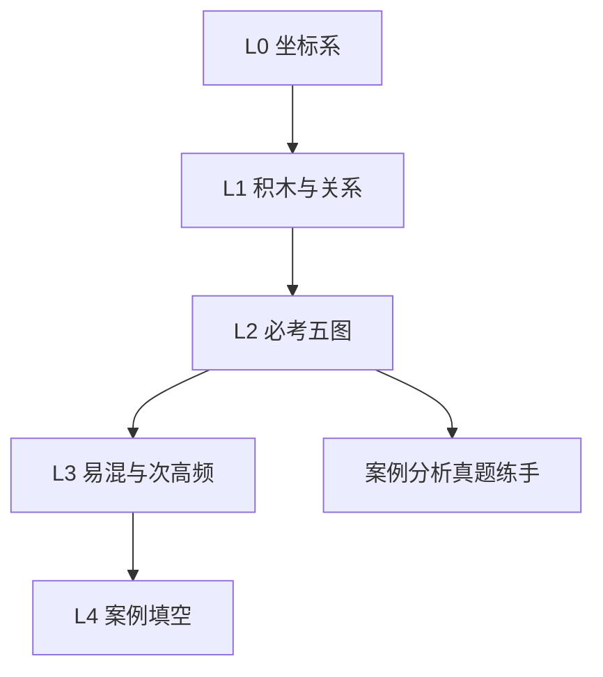
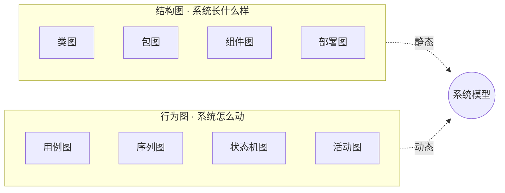
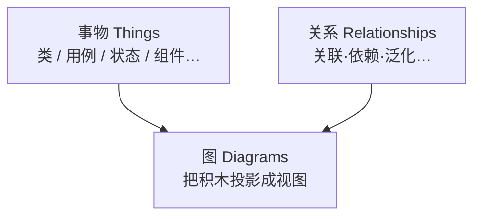
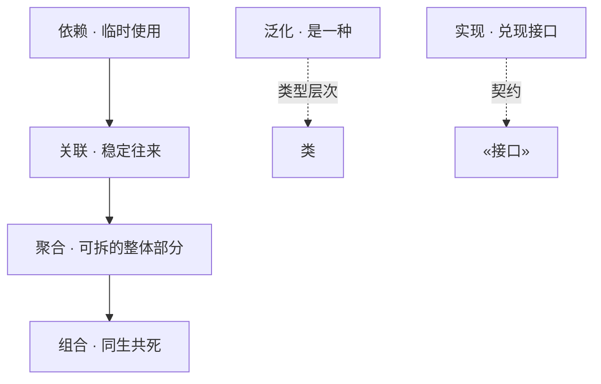
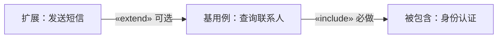
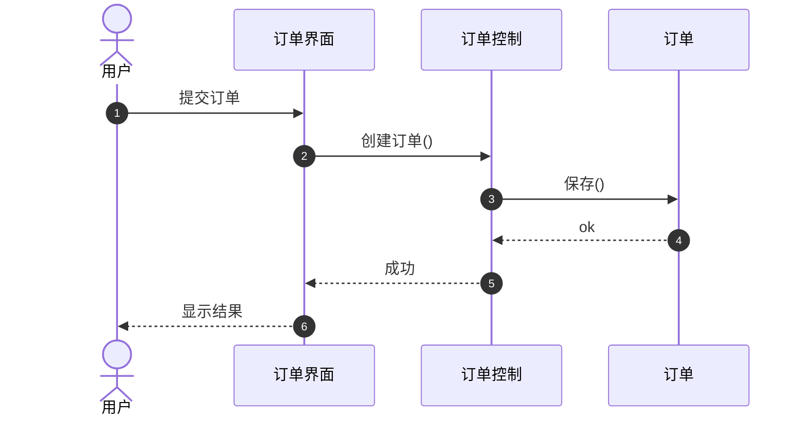
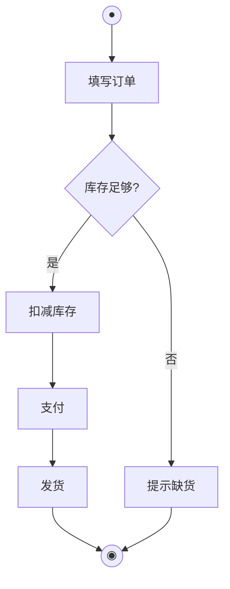
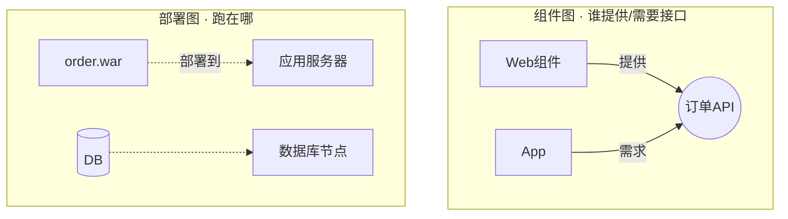
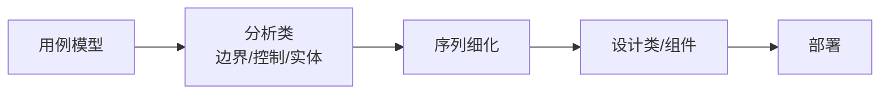

# 速查 · UML 体系化学习指南（由简入深）

> **对齐**：大纲 §5.7 统一建模语言 UML（教程第7章）+ 面向对象分析用例（第11章）  
> **规范依据**：OMG UML 2.5.1（结构 / 行为图分类、关系语义）  
> **本站旧稿**：第7章仅列图种与关系名；第11章仅有用例模型要点——本指南补全「读法、画法、易混、案例填空」并配**图形解释**  
> **读者画像**：前端向、弱数学；先看图再记口诀  
> **写作准则（定义 / 作用）**：凡「定义」「作用」写成可直接答卷的完整句——定义用「X 是……」；作用用「用于…… / 主要作用是……」；口诀仅助记。

---

## 0. 怎么用（15 分钟地图）

| 关卡 | 目标 | 建议用时 | 过关标准 |
|------|------|----------|----------|
| **L0 入门** | UML 是什么、两类图、考试考什么 | 20 分钟 | 能说「结构看静态、行为看动态」 |
| **L1 积木** | 事物 / 关系 / 图种总表 | 30 分钟 | 闭卷写出 5 种关系 + 5 种必考图 |
| **L2 必考五图** | 用例 / 类 / 序列 / 状态 / 活动 | 2–3 小时 | 见题干能选对图、会填空 |
| **L3 加深** | 聚合组合、include/extend、包/组件/部署 | 1 小时 | 易混对比不翻车 |
| **L4 应试** | 案例填空套路、4+1、OOA→OOD | 45 分钟 | 真题卷能限时开做 |



**终局口诀**

> 看清**谁** → **什么结构** → **怎么交互/变状态** → 空白处回扣题干名词。

---

## 1. L0 · 入门：先立坐标系

### 1.1 UML 是什么（答卷·定义 / 作用）

**UML（答卷·定义）**  
UML（统一建模语言）是一套用标准图形符号描述软件系统静态结构与动态行为的可视化建模语言；它不是编程语言，也不是软件开发过程本身。

**UML 的作用（答卷）**  
UML 用于在分析、设计与沟通中统一表达系统模型，帮助干系人就「系统长什么样、如何运作」达成一致，并为需求分析、架构设计、实现与测试提供可共享的图示依据。

### 1.2 两大语义区（先看这张总图）



| 类别 | **答卷·定义** | **答卷·作用** | 考试关键词 |
|------|---------------|---------------|------------|
| **结构图** | 结构图是描述系统静态构成与元素间连接关系的 UML 图。 | 用于说明系统由哪些构件组成、如何组织与部署。 | 类、包、组件、部署 |
| **行为图** | 行为图是描述系统动态运作、交互与状态变化的 UML 图。 | 用于说明系统如何响应用户与事件、对象如何协作与迁移。 | 用例、序列、活动、状态 |

**必考优先级**：用例 → 类 → 序列 → 状态 → 活动 → 组件/部署。

---

## 2. L1 · 积木：事物、关系、图种

### 2.1 三类积木（答卷）

| 积木 | **答卷·定义** | **答卷·作用** |
|------|---------------|---------------|
| **事物 Things** | 事物是 UML 模型中的基本建模元素（如类、用例、状态、组件等）。 | 用于命名并表示问题域或系统中的概念实体。 |
| **关系 Relationships** | 关系是模型元素之间具有语义的连接。 | 用于表达元素之间如何关联、依赖、继承、实现或组成。 |
| **图 Diagrams** | 图是把事物与关系按某一视角投影而成的视图。 | 用于从结构或行为侧面展示系统模型，支撑沟通与分析设计。 |



### 2.2 六种关系 · 图形速查（菱形在整体侧）

<figure class="uml-figure">
<svg viewBox="0 0 720 420" xmlns="http://www.w3.org/2000/svg" role="img" aria-label="UML六种关系符号">
  <style>
    .t{font:14px sans-serif;fill:#d7e0ea}
    .s{font:12px sans-serif;fill:#8b9bb0}
    .box{fill:#1a2330;stroke:#4a5d73;stroke-width:1.5;rx:6}
    .line{stroke:#c5d0dc;stroke-width:2;fill:none}
    .dash{stroke-dasharray:6 4}
  </style>
  <!-- 关联 -->
  <text class="t" x="24" y="28">1 关联 Association ·「认识」</text>
  <rect class="box" x="40" y="44" width="70" height="36"/><text class="t" x="58" y="67">A</text>
  <line class="line" x1="110" y1="62" x2="200" y2="62"/>
  <rect class="box" x="200" y="44" width="70" height="36"/><text class="t" x="218" y="67">B</text>
  <text class="s" x="300" y="66">实线连接</text>

  <!-- 依赖 -->
  <text class="t" x="24" y="110">2 依赖 Dependency ·「用一下」</text>
  <rect class="box" x="40" y="126" width="70" height="36"/><text class="t" x="58" y="149">A</text>
  <line class="line dash" x1="110" y1="144" x2="190" y2="144"/>
  <polygon points="200,144 188,138 188,150" fill="#c5d0dc"/>
  <rect class="box" x="200" y="126" width="70" height="36"/><text class="t" x="218" y="149">B</text>
  <text class="s" x="300" y="148">虚线 + 开放箭头（指向被依赖方）</text>

  <!-- 泛化 -->
  <text class="t" x="24" y="192">3 泛化 Generalization ·「是一种」</text>
  <rect class="box" x="40" y="208" width="70" height="36"/><text class="t" x="52" y="231">子类</text>
  <line class="line" x1="110" y1="226" x2="185" y2="226"/>
  <polygon points="200,226 185,216 185,236" fill="#0f141c" stroke="#c5d0dc" stroke-width="2"/>
  <rect class="box" x="200" y="208" width="70" height="36"/><text class="t" x="52" y="0"></text><text class="t" x="212" y="231">父类</text>
  <text class="s" x="300" y="230">空心三角 · 指向一般（父）</text>

  <!-- 实现 -->
  <text class="t" x="24" y="274">4 实现 Realization ·「兑现契约」</text>
  <rect class="box" x="40" y="290" width="70" height="36"/><text class="t" x="55" y="313">类</text>
  <line class="line dash" x1="110" y1="308" x2="185" y2="308"/>
  <polygon points="200,308 185,298 185,318" fill="#0f141c" stroke="#c5d0dc" stroke-width="2"/>
  <rect class="box" x="200" y="290" width="90" height="36" stroke-dasharray="5 3"/><text class="t" x="215" y="313">«接口»</text>
  <text class="s" x="310" y="312">空心三角 + 虚线</text>

  <!-- 聚合 / 组合 -->
  <text class="t" x="400" y="28">5 聚合 Aggregation ·「有一些」</text>
  <rect class="box" x="420" y="44" width="70" height="36"/><text class="t" x="432" y="67">整体</text>
  <polygon points="500,62 512,54 524,62 512,70" fill="#0f141c" stroke="#c5d0dc" stroke-width="2"/>
  <line class="line" x1="524" y1="62" x2="580" y2="62"/>
  <rect class="box" x="580" y="44" width="70" height="36"/><text class="t" x="592" y="67">部分</text>
  <text class="s" x="420" y="100">空心菱形在整体侧</text>

  <text class="t" x="400" y="140">6 组合 Composition ·「长在身上」</text>
  <rect class="box" x="420" y="156" width="70" height="36"/><text class="t" x="432" y="179">整体</text>
  <polygon points="500,174 512,166 524,174 512,182" fill="#c5d0dc"/>
  <line class="line" x1="524" y1="174" x2="580" y2="174"/>
  <rect class="box" x="580" y="156" width="70" height="36"/><text class="t" x="592" y="179">部分</text>
  <text class="s" x="420" y="212">实心菱形 · 同生共死</text>

  <text class="s" x="400" y="260">记忆：菱形永远贴着「整体」；</text>
  <text class="s" x="400" y="280">空心=可拆散；实心=拆不了。</text>
</svg>
<figcaption>图 L1 · UML 六种关系符号一览（考试默画用）</figcaption>
</figure>

| 关系 | 符号 | 口诀 |
|------|------|------|
| 关联 | 实线 | 「认识」 |
| 依赖 | 虚线箭头 | 「用一下」 |
| 泛化 | 空心三角实线 | 「是一种」 |
| 实现 | 空心三角虚线 | 「兑现契约」 |
| 聚合 | 空心菱 | 「有一些」 |
| 组合 | 实心菱 | 「长在身上」 |

### 2.2.1 六种关系 · 答卷定义与作用

> **关系（答卷·定义）**：关系是 UML 模型元素之间具有语义的连接。类图中最常考查；用例图中另有通信关联以及 `«include»` / `«extend»`（见 §3.1）。  
> **关系的作用（答卷）**：关系用于标明模型元素之间如何联系与协作，使静态结构与动态交互可被准确表达和阅读。

| 关系 | **答卷·定义** | **答卷·作用** | 符号要点 |
|------|---------------|---------------|----------|
| **关联** Association | 关联是类与类之间稳定、可导航的结构联系。 | 用于表达业务对象之间「谁与谁有往来」，并可标注角色名与多重性。 | 实线 |
| **依赖** Dependency | 依赖是一个模型元素的变化可能影响另一元素的使用性弱耦合关系。 | 用于表达临时使用、调用或参数传递等「用一下」关系，不强调长期持有。 | 虚线开放箭头，指向被依赖方 |
| **泛化** Generalization | 泛化是一般类与特殊类之间的「是一种」继承关系。 | 用于表达子类继承父类特征并可特化，建立类型层次。 | 空心三角实线，三角指向父类 |
| **实现** Realization | 实现是分类器兑现另一分类器（常为接口）所规定契约的关系。 | 用于表达类（或构件）对接口规范的承诺与兑现。 | 空心三角虚线，三角指向接口 |
| **聚合** Aggregation | 聚合是整体与部分之间的关系，且部分可以脱离整体独立存在。 | 用于表达「整体拥有/包含部分」但部分生命周期不强制绑定于整体。 | 空心菱形在整体侧 |
| **组合** Composition | 组合是更强的整体—部分关系，部分的生命周期从属于整体。 | 用于表达部分是整体的构成要素，整体消亡则部分一同失去独立存在意义。 | 实心菱形在整体侧 |

**强度（答卷可写）**：在结构联系上，依赖弱于关联，关联弱于聚合，聚合弱于组合。泛化与实现属于类型/契约关系，不按菱形强弱排序。



**易混（答卷对比句）**

| 对比 | 可直接写的区别 |
|------|----------------|
| 关联 vs 依赖 | 关联强调稳定结构联系；依赖强调临时使用，一方变化可能影响另一方。 |
| 聚合 vs 组合 | 聚合中部分可独立存在；组合中部分生命周期从属于整体。 |
| 泛化 vs 实现 | 二者均为空心三角；实线表示继承父类，虚线表示实现接口。 |
| 菱形方向 | 菱形始终画在整体一端。 |

**多重性（答卷）**：多重性写在关联线两端，用于说明一端的一个实例可以对应另一端多少个实例。例如「读者 1 —— \* 预约记录」表示一个读者可对应多条预约记录。

**口诀（助记，勿当答卷）**：关联「认识」· 依赖「用一下」· 泛化「是一种」· 实现「兑现契约」· 聚合「有一些」· 组合「长在身上」。

**前端类比（勿写进答案）**：关联≈模块间稳定引用；依赖≈临时 import；泛化≈继承；实现≈兑现接口约定；聚合≈可挪走的子项；组合≈随父卸载的子项。

### 2.3 图种 · 答卷定义与作用（结构 / 行为）

| 图 | **答卷·定义** | **答卷·作用** | 热度 |
|----|---------------|---------------|------|
| **用例图** | 用例图是描述系统边界外参与者与系统内用例及其关系的行为图。 | 用于界定系统功能范围，说明「谁与系统交互、系统完成哪些有价值目标」。 | ★★★★★ |
| **类图** | 类图是描述类、接口及其属性、操作与静态关系的结构图。 | 用于展示问题域或设计中的概念结构与类间联系。 | ★★★★★ |
| **序列图** | 序列图是按时间顺序描述对象之间消息交互的行为图。 | 用于说明某一场景下对象如何依次协作完成一次交互。 | ★★★★★ |
| **状态机图** | 状态机图是描述某一个对象在生命周期中状态及迁移的行为图。 | 用于说明对象在何种事件下从一状态转到另一状态。 | ★★★★ |
| **活动图** | 活动图是描述业务流程中动作、分支、合并与并行的行为图。 | 用于说明工作如何推进、何处分支或并行，以及角色分工（泳道）。 | ★★★★ |
| **组件图** | 组件图是描述软件组件及其提供/需求接口的结构图。 | 用于说明模块如何封装与通过接口装配。 | ★★★ |
| **部署图** | 部署图是描述运行时节点及制品如何部署到节点上的结构图。 | 用于说明软件部署在哪些机器/环境上运行。 | ★★★ |
| **包图** | 包图是描述模型元素分组与包间依赖的结构图。 | 用于组织大型模型、展示命名空间与依赖边界。 | ★★ |

**必考五图优先记**：用例、类、序列、状态机、活动。

---

## 3. L2 · 必考五图（精读 · 带图）

### 3.1 用例图 Use Case

**答卷·定义**：用例图是描述系统边界外参与者与系统内用例及其关系的行为图。  
**答卷·作用**：用于界定系统功能范围，说明谁与系统交互、系统为参与者完成哪些有价值目标。

<figure class="uml-figure">
<svg viewBox="0 0 640 320" xmlns="http://www.w3.org/2000/svg" role="img" aria-label="用例图示例">
  <style>
    .t{font:13px sans-serif;fill:#d7e0ea}
    .s{font:11px sans-serif;fill:#8b9bb0}
    .bound{fill:#15202b;stroke:#5b7c99;stroke-width:2;rx:4}
    .uc{fill:#1e2a38;stroke:#7eb8da;stroke-width:2}
    .line{stroke:#c5d0dc;stroke-width:1.6;fill:none}
    .dash{stroke-dasharray:5 4}
  </style>
  <!-- actor -->
  <circle cx="70" cy="90" r="14" fill="none" stroke="#c5d0dc" stroke-width="2"/>
  <line x1="70" y1="104" x2="70" y2="150" stroke="#c5d0dc" stroke-width="2"/>
  <line x1="50" y1="120" x2="90" y2="120" stroke="#c5d0dc" stroke-width="2"/>
  <line x1="70" y1="150" x2="52" y2="185" stroke="#c5d0dc" stroke-width="2"/>
  <line x1="70" y1="150" x2="88" y2="185" stroke="#c5d0dc" stroke-width="2"/>
  <text class="t" x="48" y="210">用户</text>
  <text class="s" x="40" y="228">参与者</text>

  <!-- system boundary -->
  <rect class="bound" x="160" y="40" width="360" height="240"/>
  <text class="t" x="280" y="62">通讯录系统</text>

  <ellipse class="uc" cx="300" cy="120" rx="78" ry="28"/>
  <text class="t" x="258" y="125">查询联系人</text>

  <ellipse class="uc" cx="300" cy="200" rx="70" ry="26"/>
  <text class="t" x="262" y="205">身份认证</text>

  <ellipse class="uc" cx="460" cy="120" rx="70" ry="26"/>
  <text class="t" x="422" y="125">发送短信</text>

  <line class="line" x1="90" y1="120" x2="222" y2="120"/>
  <line class="line dash" x1="300" y1="148" x2="300" y2="174"/>
  <polygon points="300,174 295,164 305,164" fill="#7eb8da"/>
  <text class="s" x="308" y="168">«include»</text>

  <line class="line dash" x1="390" y1="120" x2="378" y2="120"/>
  <line class="line dash" x1="390" y1="120" x2="422" y2="120"/>
  <polygon points="378,120 388,115 388,125" fill="#7eb8da"/>
  <text class="s" x="385" y="108">«extend»</text>

  <text class="s" x="170" y="290">边界内=用例；边界外=参与者</text>
</svg>
<figcaption>图 3-1 · 用例图：参与者、边界、用例、include / extend</figcaption>
</figure>

#### include vs extend（答卷）

| | **答卷·定义** | **答卷·作用** | 箭头 |
|--|---------------|---------------|------|
| **«include»** | include 是基用例必然包含另一用例行为的关系。 | 用于抽取每次都必须执行的公共子流程。 | 基用例 → 被包含用例 |
| **«extend»** | extend 是在特定条件下由扩展用例为基用例增加行为的关系。 | 用于表示可选增值功能或条件触发的扩展行为。 | 扩展用例 → 基用例 |



| | include | extend |
|--|---------|--------|
| 时机 | **每次**都执行 | 条件满足才执行 |
| 话术 | 抽公共子流程 | 可选增值/异常 |

#### 案例填空看哪里

1. 边界外空白 → **参与者**  
2. 椭圆空白 → **用例名**（动宾）  
3. 虚线旁 → 先判必经/可选，再写 include 或 extend  

---

### 3.2 类图 Class

**答卷·定义**：类图是描述类、接口及其属性、操作与静态关系的结构图。  
**答卷·作用**：用于展示问题域或设计中的概念结构，说明有哪些类以及类之间如何关联。

<figure class="uml-figure">
<svg viewBox="0 0 680 300" xmlns="http://www.w3.org/2000/svg" role="img" aria-label="类图示例">
  <style>
    .t{font:12px sans-serif;fill:#d7e0ea}
    .s{font:11px sans-serif;fill:#8b9bb0}
    .box{fill:#1a2330;stroke:#7eb8da;stroke-width:1.6}
    .div{stroke:#4a5d73;stroke-width:1}
    .line{stroke:#c5d0dc;stroke-width:1.8;fill:none}
  </style>
  <!-- Order -->
  <rect class="box" x="40" y="40" width="150" height="120"/>
  <line class="div" x1="40" y1="68" x2="190" y2="68"/>
  <line class="div" x1="40" y1="110" x2="190" y2="110"/>
  <text class="t" x="88" y="60">订单</text>
  <text class="s" x="52" y="88">-订单号</text>
  <text class="s" x="52" y="104">-金额</text>
  <text class="s" x="52" y="130">+提交()</text>
  <text class="s" x="52" y="146">+支付()</text>

  <!-- OrderLine -->
  <rect class="box" x="360" y="50" width="150" height="100"/>
  <line class="div" x1="360" y1="78" x2="510" y2="78"/>
  <line class="div" x1="360" y1="112" x2="510" y2="112"/>
  <text class="t" x="398" y="70">订单明细</text>
  <text class="s" x="372" y="98">-数量</text>
  <text class="s" x="372" y="132">+小计()</text>

  <!-- composition -->
  <polygon points="200,95 212,87 224,95 212,103" fill="#c5d0dc"/>
  <line class="line" x1="224" y1="95" x2="360" y2="95"/>
  <text class="s" x="250" y="86">1</text>
  <text class="s" x="330" y="86">1..*</text>
  <text class="s" x="250" y="118">组合：删订单→明细没了</text>

  <!-- Boundary Control Entity -->
  <rect class="box" x="40" y="210" width="120" height="50" rx="4"/>
  <text class="t" x="62" y="240">边界 Boundary</text>
  <rect class="box" x="200" y="210" width="120" height="50" rx="4"/>
  <text class="t" x="225" y="240">控制 Control</text>
  <rect class="box" x="360" y="210" width="120" height="50" rx="4"/>
  <text class="t" x="388" y="240">实体 Entity</text>
  <text class="s" x="500" y="240">分析类三角色</text>
</svg>
<figcaption>图 3-2 · 类盒子三格 + 组合关系 + 分析类三角色</figcaption>
</figure>

**三格**：类名 / 属性 / 操作()。可见性：`+` public · `-` private · `#` protected。

**分析类三角色 BCE（答卷·定义 / 作用）**

| 角色 | 答卷·定义 | 答卷·作用 |
|------|-----------|-----------|
| **边界 Boundary** | 边界类是系统与参与者（或其他外部系统、设备）之间的交互接口类。 | 用于接收外部输入、返回处理结果并完成交互适配，隔离系统内外；不承担核心业务数据的持久保存。 |
| **控制 Control** | 控制类是协调完成某一用例（或其中控制流程）的编排类。 | 用于按规定顺序调用相关对象、处理分支与异常，实现用例处理流程；不长期保存业务数据。 |
| **实体 Entity** | 实体类是问题域中具有持久业务意义的信息及其业务规则的载体类。 | 用于表达并保存业务对象的状态与约束，供控制类在用例执行中读写。 |

**采用 BCE 的作用（答卷）**：按职责分离界面交互、流程编排与业务数据，避免职责混杂，便于建立分析模型并衔接到序列图与设计。  
**口诀（助记）**：界面收发、控制编排、实体存业务。  
**协作（答卷）**：参与者通过边界类交互，边界类将请求交控制类，控制类再调用实体类。一条用例常对应 1 边界 + 1 控制 + 若干实体。详解见 `速查/结构化与面向对象分析-体系化学习路径.md` · §4.4。

**多重性读法**：靠近对端的数字 = 「一个本端对应几个对端」。

---

### 3.3 序列图 Sequence

**答卷·定义**：序列图是按时间顺序描述对象之间消息交互的行为图。  
**答卷·作用**：用于说明某一场景下对象如何依次发送消息、协作完成一次交互。



<figure class="uml-figure">
<pre class="uml-ascii">
  用户          订单界面         订单控制          订单
   │               │               │               │
   │  提交订单      │               │               │
   │──────────────►│               │               │
   │               │ 创建订单()    │               │
   │               │──────────────►│               │
   │               │               │   保存()      │
   │               │               │──────────────►│
   │               │               │◄─ ─ ─ ok ─ ─ ─│
   │               │◄── 成功 ──────│               │
   │◄── 显示结果 ──│               │               │
   ▼               ▼               ▼               ▼
              ↑ 生命线（时间向下）      激活条=正在干活
</pre>
<figcaption>图 3-3 · 序列图读法：生命线、消息、返回（虚线）</figcaption>
</figure>

| 元素 | 含义 |
|------|------|
| 生命线 | 对象在时间上的存在 |
| 同步消息 | 实心箭头，调用方等待 |
| 返回 | 虚线箭头（可省略） |
| `alt`/`opt`/`loop` | 分支 / 可选 / 循环片段 |

---

### 3.4 状态机图 State Machine

**答卷·定义**：状态机图是描述某一个对象在其生命周期中所处状态及状态迁移的行为图。  
**答卷·作用**：用于说明该对象在何种事件（及条件）下从一种状态转到另一种状态。

<figure class="uml-figure">
<svg viewBox="0 0 700 220" xmlns="http://www.w3.org/2000/svg" role="img" aria-label="订单状态机">
  <style>
    .t{font:12px sans-serif;fill:#d7e0ea}
    .s{font:11px sans-serif;fill:#8b9bb0}
    .st{fill:#1a2330;stroke:#7eb8da;stroke-width:1.8;rx:14}
    .line{stroke:#c5d0dc;stroke-width:1.6;fill:none}
  </style>
  <circle cx="30" cy="100" r="8" fill="#c5d0dc"/>
  <line class="line" x1="38" y1="100" x2="70" y2="100"/>
  <polygon points="70,100 60,95 60,105" fill="#c5d0dc"/>

  <rect class="st" x="70" y="78" width="90" height="44"/>
  <text class="t" x="88" y="105">待支付</text>

  <line class="line" x1="160" y1="100" x2="210" y2="100"/>
  <polygon points="210,100 200,95 200,105" fill="#c5d0dc"/>
  <text class="s" x="162" y="90">支付成功</text>

  <rect class="st" x="210" y="78" width="90" height="44"/>
  <text class="t" x="228" y="105">已支付</text>

  <line class="line" x1="300" y1="100" x2="350" y2="100"/>
  <polygon points="350,100 340,95 340,105" fill="#c5d0dc"/>
  <text class="s" x="312" y="90">发货</text>

  <rect class="st" x="350" y="78" width="90" height="44"/>
  <text class="t" x="368" y="105">已发货</text>

  <line class="line" x1="440" y1="100" x2="490" y2="100"/>
  <polygon points="490,100 480,95 480,105" fill="#c5d0dc"/>
  <text class="s" x="448" y="90">签收</text>

  <rect class="st" x="490" y="78" width="80" height="44"/>
  <text class="t" x="510" y="105">完成</text>

  <line class="line" x1="570" y1="100" x2="610" y2="100"/>
  <circle cx="620" cy="100" r="10" fill="none" stroke="#c5d0dc" stroke-width="2"/>
  <circle cx="620" cy="100" r="5" fill="#c5d0dc"/>

  <path class="line" d="M115 122 Q115 175 250 175 Q380 175 380 122"/>
  <polygon points="380,122 372,130 388,130" fill="#c5d0dc"/>
  <text class="s" x="200" y="192">超时 / 取消 → 也可画到「已取消」状态</text>
</svg>
<figcaption>图 3-4 · 订单状态机：初态● → 状态 → 终态◉；箭头旁写事件</figcaption>
</figure>

| 何时用状态图 | 何时用活动图 |
|--------------|--------------|
| 焦点是**一个对象**的状态 | 焦点是**业务流程**步骤/并行 |
| 「处于什么状态」 | 「下一步做什么」 |

迁移标注格式：`事件[条件]/动作`

---

### 3.5 活动图 Activity

**答卷·定义**：活动图是描述业务流程中动作、分支、合并与并行的行为图。  
**答卷·作用**：用于说明工作流程如何推进、何处分支或并行，以及不同角色如何分工（泳道）。



| 元素 | 画法 |
|------|------|
| 动作 | 圆角矩形 |
| 决策 | 菱形 |
| 分叉/汇合 | 粗横线（并行） |
| 泳道 | 按角色分列 |

与流程图三区别：可表达**并行**、**对象流/泳道**、基于 **token** 语义（UML 2）。

---

## 4. L3 · 加深：易混与次高频

### 4.1 聚合 vs 组合（答卷再钉死）

**聚合（答卷·定义）**：聚合是整体与部分之间的关系，且部分可以脱离整体独立存在。符号为空心菱形，菱形画在整体一侧。  
**聚合的作用（答卷）**：用于表达整体对部分的拥有/包含，但不强制部分与整体同生共死。

**组合（答卷·定义）**：组合是更强的整体—部分关系，部分的生命周期从属于整体。符号为实心菱形，菱形画在整体一侧。  
**组合的作用（答卷）**：用于表达部分是整体的构成要素；整体删除或消亡时，部分通常一并失去独立存在意义。

```mermaid
flowchart LR
  Team[车队] --o 车1[车辆]
  Order[订单] --* Line[订单明细]
```

| | 聚合 ○ | 组合 ● |
|--|--------|--------|
| 生命周期 | 部分可独立于整体 | 部分随整体消亡 |
| 例子 | 车队—车；书架—书 | 订单—明细 |
| 判题句 | 「拆开后部分还在」 | 「删整体则部分没了」 |

**答卷补充**：聚合与组合都是带整体—部分语义的特殊关联；题干出现删除级联、同生共死信号时，优先判为组合。

### 4.2 组件图 / 部署图（答卷）

| 图 | **答卷·定义** | **答卷·作用** |
|----|---------------|---------------|
| **组件图** | 组件图是描述软件组件及其提供接口、需求接口的结构图。 | 用于说明系统由哪些可替换构件组成、彼此如何通过接口装配。 |
| **部署图** | 部署图是描述运行时处理节点及软件制品如何部署到节点上的结构图。 | 用于说明软件在哪些机器、设备或环境下运行。 |



---

## 5. L4 · 应试：看图填空

### 5.1 题干信号 → 选图

| 题干信号 | 优先图 |
|----------|--------|
| 角色、功能目标、边界 | 用例 |
| 概念类、属性、多重性 | 类图 |
| 调用顺序、消息 | 序列 |
| 状态、超时取消 | 状态机 |
| 流程、并行、审批 | 活动 |
| 部署到哪台机器 | 部署 |

### 5.2 填空四步

1. 圈题干名词  
2. 定空白语义（名 / 关系 / 消息 / 事件）  
3. 核对关系方向（include/extend、菱形在整体）  
4. **用题干原词**填

### 5.3 OOA→OOD 链条（图）



### 5.4 30 秒默写

- [ ] UML 定义 + 作用各一句  
- [ ] 结构图 / 行为图：定义 + 作用  
- [ ] 六关系：各能默写「是……」「用于……」  
- [ ] 必考五图：各能默写定义 + 作用  
- [ ] include / extend：定义、作用、箭头方向  
- [ ] 聚合 vs 组合：定义 + 作用  
- [ ] 分析类三角色  
- [ ] 状态图 vs 活动图  

---

## 6. 迷你练习

**A** 共享单车：列出 ≥3 用例、≥2 参与者（先在纸上画小人+椭圆）。  
**B** 「删订单则明细一起删」→ 组合还是聚合？菱形在哪侧？各用一句话给出**定义**依据。  
**C** 订单待支付→已支付→已发货→完成，超时取消 → 用哪张图？  
**D** 用一句话区分：关联 vs 依赖；泛化 vs 实现。

**要点**：B 组合（部分生命周期从属整体）、实心菱在订单侧；C 状态机图；D 见 §2.2.1。

---

## 7. 与本站材料

| 材料 | 关系 |
|------|------|
| 第7章 UML 概要 | 考前 30 秒回忆 |
| 第11章 用例模型 | 规约与构建步骤 |
| 案例分析真题 | 五图实战场 |

站点知识点页已支持 **Mermaid 图形渲染**；本页 SVG / ASCII 图无需外网亦可看。

---

## 8. 规范说明

- 对齐 **OMG UML 2.5.1**。软考或用「顺序图/协作图」旧称，与序列图/通信图概念等价即可。  
- **定义 / 作用写作准则**：凡「定义」「作用」须可直接用于案例/简答——定义用「X 是……」，作用用「用于…… / 主要作用是……」；口诀与前端类比仅助记。  
- 关系详解见 §2.2.1；图种详解见 §2.3 与 §3；聚合/组合与组件/部署见 §4。
