# 速查 · 结构化与面向对象分析体系化学习路径（教程化问答）

> **对齐大纲**：§9.4 结构化分析（DFD、STD、数据字典）+ §9.5 面向对象分析（用例、分析模型）（教程第11章 §11.4–11.5）  
> **规范依据**：系统分析师教程需求工程章 + 系统规划章 DFD 规则；用例符号对齐 OMG UML 2.5.1  
> **本站旧稿**：第11章精炼仅列要点；第10章 DFD 偏规划阶段——本路径补全「由简入深」读法、画法、易混与案例填空  
> **读者画像**：前端向、弱数学；先看图再记口诀  
> **刷题入口**：综合知识 → 学习路径选 **「结构化与OO分析（L0→L4）」**（按关卡顺序，建议关闭随机）  
> **写作准则（定义 / 作用）**：凡「定义」「作用」均须写成**可直接用于答题**的完整句——定义用「X 是……」；作用用「用于…… / 主要作用是……」；禁止只留关键词碎片。口诀可另记，答卷贴完整句。

---

## 0. 怎么用（15 分钟看懂地图）

| 关卡 | 学什么 | 对应大纲 | 刷题标签 | 建议题量 |
|------|--------|----------|----------|----------|
| **L0 点：坐标系** | SA vs OOA、何时用谁、与需求工程关系 | 9.3–9.4 概览 | `L0` | 先过一遍 |
| **L1 面：DFD 入门** | 四要素、命名、0层/1层、绘制步骤 | 9.4 | `L1` | 符号扎根 |
| **L2 面：SA 加深** | 数据字典六类、STD、父子图平衡、常见错误 | 9.4 | `L2` | 改错题必练 |
| **L3 面：OOA** | 用例模型、规约、分析类 BCE、**CRC 建模**、分析模型产物 | 9.5 | `L3` | 案例+UML |
| **L4 面：串题** | SA↔OOA 对比、真题选图/填空套路、UML 五图衔接 | 9.4–9.5 | `L4` | 限时卷 |

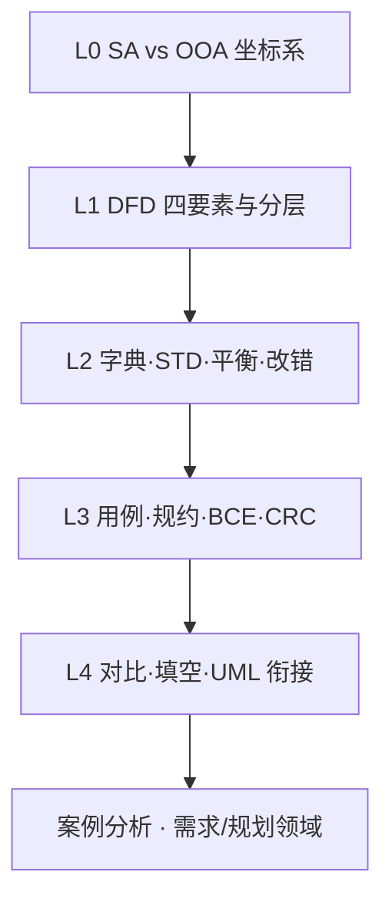

**学习节奏（推荐）**

1. 读本章精炼：`第11章-软件需求工程.md` §四（SA）与 §五（OOA）（每关 5–10 分钟）  
2. 用例符号细节 → 速查《UML-体系化学习指南》· L2.1  
3. 刷本关 `L*` 问答（先不看解析，再对答案）  
4. L2 若 DFD 分层不熟 → 补读 `第10章-系统规划与分析.md` §四  
5. L4 过完后：案例分析 → 领域 **需求** 或 **规划** 做一套限时

### 0.1 定义与作用 · 答卷写法准则（强制）

| 要求 | 合格示例 | 不合格（勿直接抄进答卷） |
|------|----------|--------------------------|
| **定义**写成「X 是……」完整句 | 「边界类是系统与参与者之间的交互接口类。」 | 「边界：界面收发」 |
| **作用**写成「用于……」或「主要作用是……」 | 「用于接收外部请求并返回结果，隔离系统内外。」 | 「隔离内外」三字 |
| 一句一个得分点，可被阅卷认出 | 含对象 + 职责边界 | 只有口诀、类比、前端黑话 |
| 口诀 / 前端类比 | 仅作记忆辅助，**不替代**答卷句 | 把「页面 / hooks」当官方定义 |

**自检**：合上书后，能否不看表、用完整句回答「什么是控制类？控制类的作用是什么？」——能，才算过关。

**终局口诀**

> **SA 看流与加工，OOA 看角色与用例；DFD 动宾守恒，用例动宾编号；边界收发、控制编排、实体存业务；CRC 先类后责再协作。**

**终局标准**：能默写「DFD 四要素 / 字典六类 / 平衡三原则 / 用例构建四步 / 分析类三角色 / CRC 三栏与四步」，并在案例题里用题干约束选 SA 还是 OOA、选哪张图。

---

## 1. L0 · 点：建立 SA 与 OOA 坐标系

### 1.1 两种分析范式各回答什么

| 范式 | 核心视角 | 主要工具 | 一句话 |
|------|----------|----------|--------|
| **结构化分析 SA** | 系统 = **数据流 + 加工** | DFD、数据字典、STD | 「数据从哪来、经谁处理、存哪去」 |
| **面向对象分析 OOA** | 系统 = **对象 + 交互** | 用例模型、分析类、UML 图 | 「谁与系统交互、完成什么目标」 |

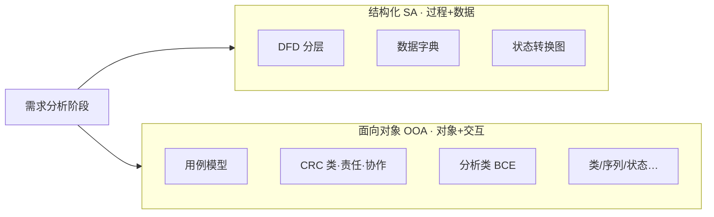

**别搞混**：SA 与 OOA 是**同一需求分析阶段**的两种建模手段，不是两个开发阶段；很多项目两者混用——DFD 理清数据流，用例理清用户目标。

### 1.2 在需求工程里的位置

需求工程 = **需求开发**（获取 → **分析** → 规格 → 验证）+ **需求管理**（基线、变更、跟踪）。

**分析阶段**（本章焦点）要做的事：

1. 把口头/文档需求**结构化表达**（画图或写规约）  
2. 发现冲突、遗漏、歧义  
3. 为后续 SRS、设计、测试提供**可跟踪**的模型

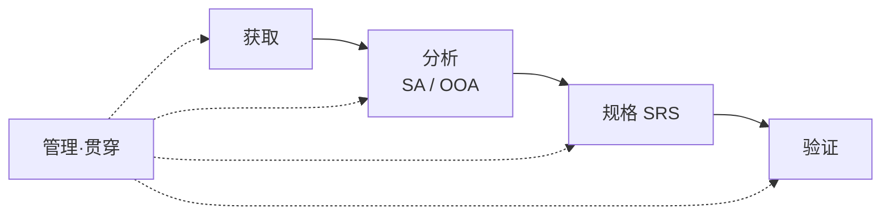

### 1.3 何时优先用 SA？何时优先用 OOA？

| 信号 | 倾向 | 理由（白话） |
|------|------|--------------|
| 业务像「流水账」、输入输出清晰、报表多 | **SA / DFD** | 数据从 A 流到 B 再存 C，过程型系统好画 |
| 角色多、交互复杂、界面/服务边界重要 | **OOA / 用例** | 先锁定「谁要什么功能」 |
| 题干给状态迁移、订单生命周期 | **STD 或 UML 状态图** | 对象/系统「处于什么状态、什么事件触发切换」 |
| 题干强调类、属性、关联、多重性 | **OOA / 类图** | 概念模型，不是 DFD |
| 规划/可行性阶段画系统与环境 | **0 层 DFD（上下文图）** | 定边界，不一定进详细 1 层 |

**考试默认**：没有明确说「面向对象」时，**DFD 改错、分层、守恒**仍是案例高频；综合知识里 **用例 + 分析类** 与 **DFD + 字典** 同等重要。

### 1.4 与 UML、设计阶段的边界

| 阶段 | 做什么 | 典型产物 |
|------|--------|----------|
| **OOA（分析）** | 理解问题域，**做什么** | 用例图、分析类（B/C/E）、领域类草图 |
| **OOD（设计）** | 解决方案，**怎么做** | 设计类、接口、组件、部署 |
| **SA → 结构化设计** | DFD → SC 结构图 | 模块划分、扇入扇出（第13章） |

**自检口诀**：「分析讲业务语言，设计讲实现细节；DFD 逻辑层别画 SQL，用例别写按钮像素。」

---

## 2. L1 · 面：结构化分析入门——DFD

### 2.1 四要素 · 图形速记

| 要素 | 图形 | 含义 | 命名要点 |
|------|------|------|----------|
| **外部实体** | 矩形 □ | 系统外的人、设备、其他系统 | 名词：顾客、银行、库房 |
| **加工 / 进程** | 圆角矩形 | 对数据的变换、处理 | **动宾短语**：校验订单、计算运费 |
| **数据存储** | 开口矩形（两横线） | 文件、表、持久化数据 | 名词：订单库、库存表 |
| **数据流** | 带箭头实线 → | 数据的流动方向与内容 | 名词短语：订单详情、付款回执 |

<figure class="uml-figure">
<pre class="uml-ascii">
  ┌────────┐                              ┌────────┐
  │  顾客  │──── 订单请求 ────►╭──────────╮│ 订单库 │
  └────────┘                   │ 处理订单 │◄�───────┘
       ▲                       ╰────┬─────╯
       │         订单确认          │
       └───────────────────────────┘

  □ 外部实体    ╭╮ 加工（动宾）    ═ 数据存储    ──► 数据流
</pre>
<figcaption>图 L1-1 · DFD 四要素示意（逻辑层）</figcaption>
</figure>

**DFD 里没有的元素**：菱形决策、虚线控制流、泳道——那些属于流程图 / 活动图，**不是 DFD**。

### 2.2 命名规则（改错题常考）

| 对象 | 正确 | 错误示例 | 为何错 |
|------|------|----------|--------|
| 加工 | **校验订单**、**更新库存** | 订单、数据、信息 | 名词堆砌，看不出「做什么变换」 |
| 数据流 | **合格订单**、**库存余量** | 流、数据 | 空洞，无法对应字典条目 |
| 外部实体 | **供应商** | 内部「订单模块」 | 系统内部功能应画成加工，不是外部实体 |

**口诀**：「**加工必动宾，数据流有名，外部在界外，存储可读写。**」

### 2.3 0 层图与 1 层图

| 层次 | 别名 | 画什么 | 加工编号 |
|------|------|--------|----------|
| **0 层** | 上下文图 / 顶层图 | 整个系统当作**一个加工**，只连外部实体与数据流 | 可标 0 或系统名 |
| **1 层** | 首次分解 | 把 0 层那个「大加工」拆成若干子加工 + 存储 | 1、2、3… 或 1.0、2.0 |
| **2 层及以下** | 继续分解 | 某个 1 层加工再展开成子图 | 1.1、1.2、2.1… |

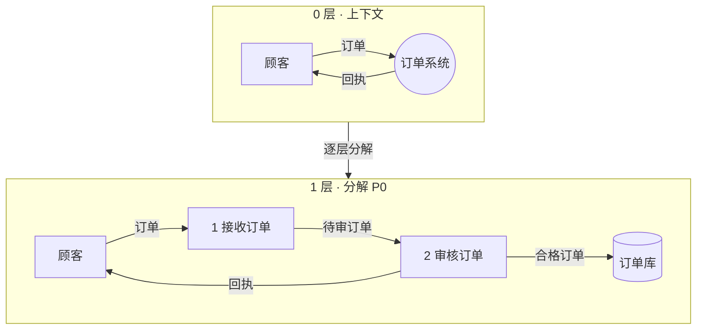

**0 层作用**：界定**系统边界**——什么在系统内（一个圈/加工），什么在外（矩形）。  
**1 层作用**：把「黑盒」打开，看清内部有哪些功能模块和数据存储。

### 2.4 绘制五步骤（需求阶段标准流程）

1. **画输入输出**：先在边缘标外部实体与进出系统的数据流  
2. **画内部加工**：从输入侧连接加工，逐步到输出  
3. **数据流命名**：每条流必须有具体名字，忌「数据」「信息」  
4. **加工命名**：一律**动宾短语**  
5. **逐层分解**：复杂加工展开成下层 DFD，直到每个加工都「简单到可写清逻辑」

### 2.5 DFD 在需求分析的三作用（选择/简答）

1. **理解表达**用户需求——团队对「数据怎么动」形成共识  
2. **概括内部逻辑**，是后续结构化设计的输入  
3. **存档材料**，需求变更时可对照修改范围

### 2.6 L1 自测

- [ ] 说出 DFD 四要素图形  
- [ ] 「库存」作加工名错在哪？应改成什么？  
- [ ] 0 层与 1 层的区别一句话  

---

## 3. L2 · 面：结构化加深——字典、STD、平衡与改错

### 3.1 数据字典：DFD 的「文字版说明书」

DFD 看图，**数据字典**给每个元素精确定义——二者**相互参照**，做一致性检验。

**六类条目**（必背）：

| 条目 | 定义什么 | 典型字段 / 要点 |
|------|----------|-----------------|
| **数据元素** | 不可再分的最小单位 | 名、类型、长度、取值范围、含义 |
| **数据结构** | 元素/结构的组合 | `[]` 任选 · `{}` 必选 · `*` 重复 |
| **数据流** | DFD 上箭头的含义 | 来源、去处、组成、流通量 |
| **数据存储** | 开口矩形 | 结构、流入/流出、查询要求 |
| **加工逻辑** | 圆角矩形内的处理 | 编号、名称、输入/输出；可用判定树/判定表/结构化语言 |
| **外部实体** | 矩形 | 名称、输入/输出数据流、数量 |

**数据结构符号示例**（填空常考）：

```
订单 = {订单号 + 顾客名 + 日期 + 明细列表*}
明细列表 = 1{商品名 + 数量 + 单价}
```

| 符号 | 含义 |
|------|------|
| `=` | 由…组成 |
| `+` | 同时出现（与） |
| `[A|B]` | A 或 B 选一 |
| `{…}` | 必选项 |
| `{…}*` | 重复 0 次或多次 |

**四作用**：列表 · 相互参照 · 内容检索 · **一致性检验**（专人维护，常称数据管理员）。

**口诀**：「**元结流存加外，六类字典配 DFD；方括任选花括必，星号表示可重复。**」

### 3.2 加工逻辑三种写法

| 方法 | 适用 | 特点 |
|------|------|------|
| **判定树** | 条件分支少、层次清晰 | 树形 if-else，直观 |
| **判定表** | 多条件组合 | 列条件、行动，不漏组合 |
| **结构化语言** | 顺序+选择+循环 | 接近伪代码，无 GOTO |

考试知道「加工逻辑条目里可挂这三种」即可；案例大题偶让补全判定表条件列。

### 3.3 状态转换图 STD

描述**系统或对象**处于哪些**状态**，在什么**事件/条件**下迁移到下一状态。

| 元素 | 画法 | 与 UML 状态图 |
|------|------|---------------|
| **初态** | 实心圆 ● | 相同 |
| **终态** | 双同心圆 ◉（内实心） | 相同 |
| **状态** | 圆角矩形 / 方框 | 迁移旁标事件/条件 |
| **转换** | 有向箭头 | STD 偏 SA 传统符号；UML 状态机图考频更高 |

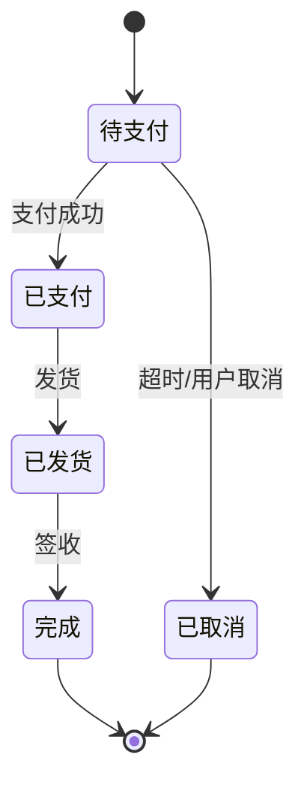

**何时用 STD / 状态图**：题干出现「订单状态」「设备待机/运行/故障」「单程或循环生命期」——**不是 DFD**，别硬画进数据流图。

**易混**：STD（SA 需求工具）vs **UML 状态机图**（OOA/设计）——符号相近，考试按题干「UML」「面向对象」选 UML 表述。

### 3.4 父子图平衡原则（案例改错核心）

**平衡**：父图中某加工的**输入数据流集合** = 子图（分解图）对外的输入；**输出**同理。子图内部新增存储、内部流，只要对外接口一致即可。

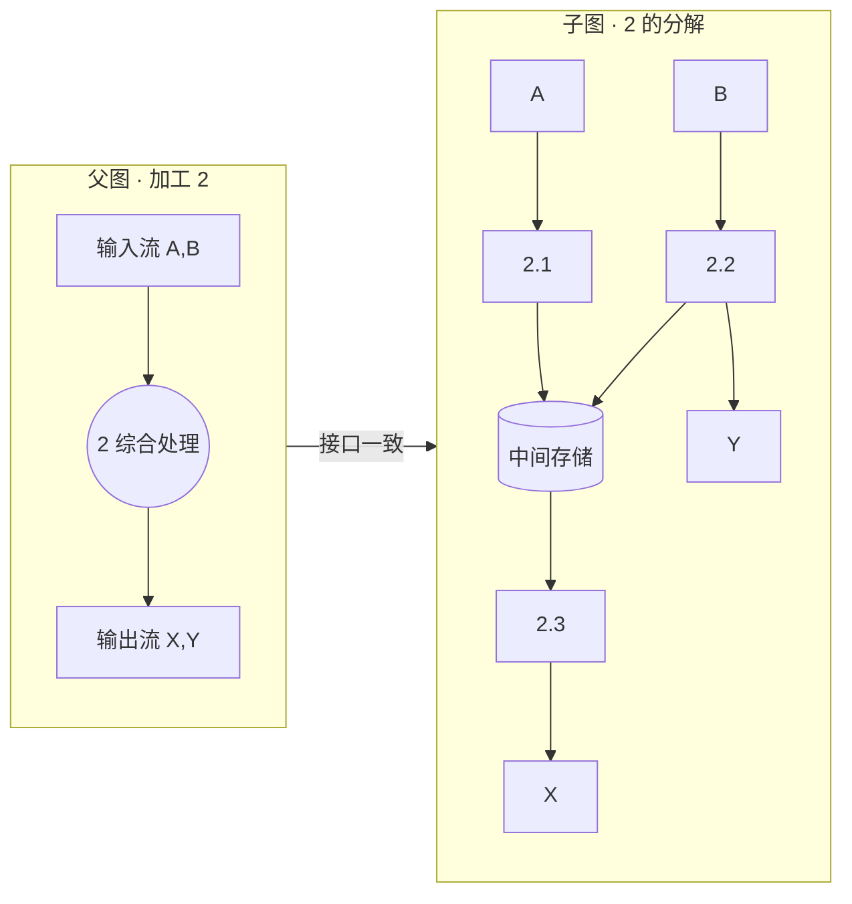

**三条守恒**（判断题）：

1. 无增删：**输入 = 输出**  
2. 有更新：**输出 = 输入 + 增量**  
3. 有删除：**处理前 = 处理后 + 丢失量**

### 3.5 DFD 绘制六规则 + 常见错误

**六规则**：

1. 仅四种基本元素，**每个必须有名字**  
2. 每个加工至少 **1 入 1 出**，保持数据守恒  
3. **按层编号**加工（1、2、1.1…）  
4. 子图与父图**一个加工**对应，**输入输出一致**（平衡）  
5. 每个数据存储必须有 **读 + 写** 的数据流（不能只有进没有出）  
6. 可加物质流辅助理解，**不可夹带控制流**

**常见错误清单**（改错题按项找）：

| # | 错误 | 正确做法 |
|---|------|----------|
| 1 | 出现菱形判断、虚线控制 | 控制逻辑写进加工说明或 STD，不画在 DFD |
| 2 | 加工名「数据」「信息」 | 改动宾：如「汇总销售数据」 |
| 3 | 数据存储只有写入无读出 | 补查询/读取流 |
| 4 | 子图比父图多/少一条对外数据流 | 按平衡原则对齐 |
| 5 | 把系统内部模块画成外部实体 | 内部一律是加工 |
| 6 | 两条同名数据流箭头含义不同 | 同名同结构，或改名区分 |
| 7 | 物理 DFD 混进「读表」「SQL」 | 需求阶段用**逻辑 DFD**，不写实现细节 |

**逻辑 DFD vs 物理 DFD**：

| | 逻辑 DFD | 物理 DFD |
|--|----------|----------|
| 抽象度 | 做什么功能 | 怎么做、用什么介质 |
| 例子 | 「保存订单」 | 「写入 Oracle 订单表」 |
| 阶段 | 需求/分析 | 接近设计 |

### 3.6 SA 三模型关系（选择/简答）

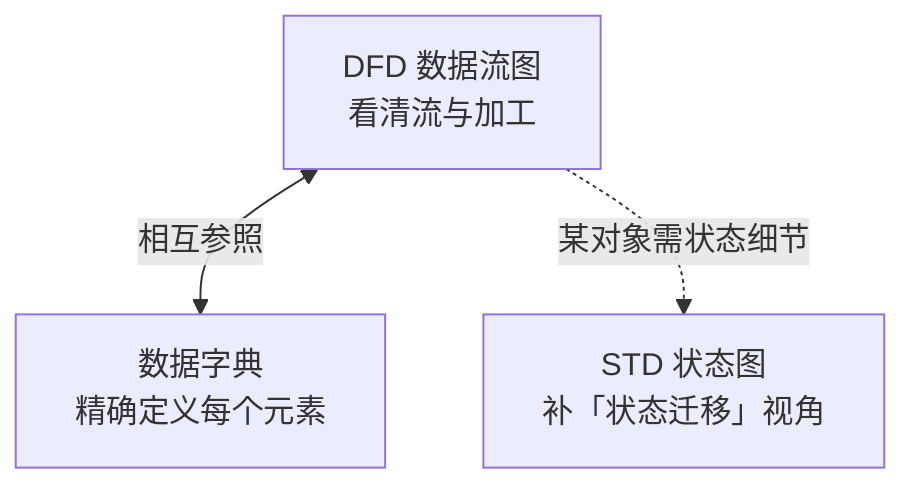

### 3.7 L2 自测

- [ ] 默写数据字典六类  
- [ ] `{商品|服务}` 与 `{商品}*` 分别什么意思？  
- [ ] 数据存储「只进不出」违反哪条规则？  
- [ ] 父图加工 3 有两条输入，子图只有一条——什么问题？

---

## 4. L3 · 面：面向对象分析——用例与分析模型

> 用例图符号、include/extend、参与者画法 → 详见 `速查/UML-体系化学习指南.md` · **§3.1**；本节补构建步骤、规约、分析类、**CRC 建模**与分析模型产物。

### 4.0 系统分析建模（答卷·定义 / 作用）

> 写法遵守 §0.1：定义用「X 是……」，作用用「用于…… / 主要作用是……」。

**系统分析建模（答卷·定义）**  
系统分析建模是在系统分析（需求分析）阶段，用图形与文字模型描述待建系统的功能、数据或对象及其关系与行为，以准确理解问题域并形成可交付分析模型的过程。

**系统分析建模的作用（答卷）**  
系统分析建模用于：澄清并结构化用户需求；发现遗漏、冲突与二义性；在干系人与开发方之间建立对「系统做什么」的共同理解；为后续概要设计、详细设计、实现与测试提供可跟踪的分析依据。

**两种常用路线（答卷可点明）**

| 路线 | 答卷·定义（建模方式） | 典型产物 | 作用侧重 |
|------|----------------------|----------|----------|
| **结构化分析建模** | 从数据加工与流动视角建立分析模型 | DFD、数据字典、STD | 理清数据从哪来、经何加工、存何处 |
| **面向对象分析建模** | 从参与者目标与问题域对象职责视角建立分析模型 | 用例模型、分析类（BCE）、交互图等 | 理清谁用系统、系统为谁完成何目标、对象如何协作 |

**建立面向对象系统分析模型的主要步骤（案例高频·答卷）**

1. 定义概念类；  
2. 确定类之间的关系；  
3. 为类添加职责；  
4. 建立交互图。  

其中前三步合称 **CRC（类–责任–协作者）建模**；第四步用交互图描述对象在业务流程中的动态协作。分析类常进一步按 **BCE（边界/控制/实体）** 划分职责。

**易混（答卷）**

| 对比 | 可直接写的区别 |
|------|----------------|
| 系统分析建模 vs 系统设计建模 | 分析建模回答「做什么」；设计建模回答「怎么做」（模块、接口、实现结构）。 |
| 系统分析模型 vs 需求获取记录 | 获取得到原始诉求；分析建模把诉求组织成规范的模型产物。 |
| CRC / BCE | CRC 是建立类模型前三步的手法；BCE 是给分析类贴职责角色；二者服务于同一套系统分析模型。 |

### 4.1 用例模型三要素

| 要素 | 含义 | 命名 |
|------|------|------|
| **参与者 Actor** | 与系统交互的外部角色（人、外部系统、设备、时钟） | 名词：收银员、支付网关 |
| **用例 Use Case** | 系统为参与者完成的**有价值目标**的一次交互 | **动宾**：提交订单、查询物流 |
| **通信关联** | 参与者与用例的交互线 | 箭头表示**主动发起方**（常考） |

**构建四阶段**：

1. **识别参与者**——谁在用系统？谁被系统调用？  
2. **合并需求得用例**——同一目标合并，粒度「一次完整业务价值」  
3. **细化描述**——写用例规约（主/备选流）  
4. **调整模型**——include/extend、拆分过胖用例、编号便于跟踪


**口诀**：「**参与者外、用例内、动宾命名要编号；步骤不是用例，业务系统分两层。**」

### 4.2 业务用例 vs 系统用例

| | 业务用例 | 系统用例 |
|--|----------|----------|
| 视角 | 组织/业务目标 | 软件系统边界内 |
| 例子 | 「客户完成门店退货」 | 「系统记录退货单并回写库存」 |
| 关系 | 业务用例可对应多个系统用例 | 不替代业务描述 |

**别混**：用例内的「步骤 1、2、3」**不是**子用例；公共子流程才用 `«include»`，可选扩展用 `«extend»`（细节见 UML 指南）。

### 4.3 用例规约（Write 什么）

| 字段 | 内容 |
|------|------|
| 用例名称 / 编号 | 动宾 + UC-001 便于**需求跟踪** |
| 说明 | 一句话目标 |
| **主事件流** | 成功路径（Happy path） |
| **备选事件流** | 分支、失败、异常 |
| 前置 / 后置条件 | 开始前须满足 / 结束后系统状态 |
| 非功能需求 | 性能、安全等（可引用 SRS 条目） |

**主 vs 备选**：

- **主事件流**：一切顺利时发生了什么  
- **备选事件流**：库存不足、支付失败、权限不够……

**白话例子**（「提交订单」片段）：

| 流 | 步骤摘要 |
|----|----------|
| 主 | 用户确认购物车 → 系统校验库存 → 生成订单 → 返回订单号 |
| 备选 3a | 库存不足 → 提示缺货商品 → 用例结束 |
| 备选 4a | 支付超时 → 订单置为待支付 → 发送提醒 |

### 4.4 分析类三角色 BCE

> **分析类（答卷·定义）**：分析类是面向对象分析阶段为划分职责而设立的临时类（可带边界/控制/实体等刻板印象），用于描述问题域职责归属，不等于最终设计类或数据库表。  
> **BCE（答卷·定义）**：BCE 是分析类的三种常见角色划分，即边界类（Boundary）、控制类（Control）、实体类（Entity）。

**采用 BCE 的作用（答卷可整段用）**

采用边界、控制、实体三角色划分分析类，主要作用是：按职责分离界面交互、流程编排与业务数据，避免单一类职责混杂；使一条用例可映射为「边界收发 → 控制编排 → 实体读写」，便于建立分析模型并衔接到序列图与后续设计。

| 角色 | **答卷·定义**（问「什么是…」直接写） | **答卷·作用**（问「作用是什么 / 有何用」直接写） | 典型例子（非定义） |
|------|--------------------------------------|--------------------------------------------------|--------------------|
| **边界类** Boundary | 边界类是系统与参与者（或其他外部系统、设备）之间的**交互接口类**。 | 边界类用于接收外部输入、返回处理结果并完成交互适配，将系统内部与外部环境隔离；不承担核心业务规则的持久保存。 | 页面、表单、API 入口、支付网关适配、终端扫码界面 |
| **控制类** Control | 控制类是协调完成某一用例（或用例中某一控制流程）的**编排类**。 | 控制类用于按规定顺序调用相关对象、处理分支与异常，实现该用例的业务处理流程；不长期保存业务数据。 | 下单控制、核验控制、派工控制 |
| **实体类** Entity | 实体类是问题域中具有持久业务意义的**信息及其业务规则的载体类**。 | 实体类用于表达并保存业务对象的状态与约束，供控制类在用例执行过程中进行读写。 | 订单、预约记录、读者、座位、工单、库存 |

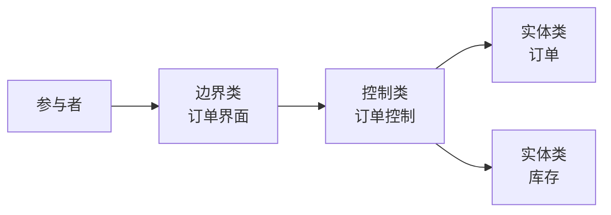

**协作关系（答卷可写）**

参与者通过边界类与系统交互；边界类将请求交给控制类；控制类再调用一个或多个实体类完成业务处理。控制类不代替实体类保存业务数据。

**口诀（仅助记，答卷用上表完整句）**：「界面收发、控制编排、实体存业务。」  
**一条用例**常对应：1 个边界类 + 1 个控制类 + 若干实体类；再用序列图描述消息顺序（UML 指南 §3.3）。

**判题信号**

| 题干说法 | 更可能是 |
|----------|----------|
| 界面、窗口、API 入口、外设适配、与参与者对话 | **边界** |
| 协调、编排、驱动用例步骤、事务流程 | **控制** |
| 订单/账户/库存等业务名词、要持久保存 | **实体** |
| 「既管界面又写库又编排」的大杂烩类 | **反例** → 应拆成 B/C/E |

**易混（答卷对比句）**

| 对比 | 可直接写的区别 |
|------|----------------|
| 边界类 vs 参与者 | 参与者位于系统外部；边界类位于系统内部，是对接外部的接口。 |
| 控制类 vs 实体类 | 控制类负责流程如何执行；实体类负责业务数据是什么及其约束。 |
| 分析类 vs 设计类 | 分析类是分析阶段的职责划分；设计类补充实现细节，一个分析类可对应多个设计类。 |
| BCE vs MVC | 二者思想相近，但系统分析师考试答卷应使用边界/控制/实体（BCE）表述。 |
| 实体类 vs DFD 外部实体 | UML 实体类是系统内业务对象；DFD 外部实体是系统外的数据源或宿。 |

**书房预约 · 答卷对号**

| 类名草稿 | 角色 | 答卷·作用一句 |
|----------|------|----------------|
| 读者预约界面 / 核验终端界面 | 边界 | 用于接收预约或核验输入并向读者/工作人员返回结果。 |
| 预约控制 / 核验控制 | 控制 | 用于编排查余量、写预约、生成预约码（或核验）等处理步骤。 |
| 读者、预约记录、座位、时段 | 实体 | 用于保存预约状态、取消次数、座位余量等业务信息与约束。 |

### 4.5 CRC 建模（类–责任–协作者）

> **考频提醒**：案例分析常问「建立分析模型的主要步骤」；标准答法里 **前三步合称 CRC 建模**，第四步才是交互图。勿与网络里的 **CRC 循环冗余校验** 混淆。

**CRC（答卷·定义）**：CRC 是类–责任–协作者（Class-Responsibility-Collaborator）建模方法，用卡片明确每个概念类的名称、职责以及完成职责时需要协作的其他类。

**CRC 建模的作用（答卷）**：CRC 建模用于在面向对象分析中识别概念类、厘清类的职责与类间协作关系，为建立类模型奠定基础；通常覆盖「定义概念类、确定类关系、为类添加职责」三步。

一张 CRC 卡片三栏（纸片或表格均可）：

| 栏 | **答卷·定义** | **答卷·作用** | 例子（书房预约） |
|----|---------------|---------------|------------------|
| **类 Class** | 类栏填写问题域中的概念类名称。 | 用于标明「有哪些对象参与业务」。 | 读者、预约记录、座位、预约管理 |
| **责任 Responsibility** | 责任栏填写该类知道什么、能够做什么。 | 用于规定该类的行为与知识边界，而不是仅罗列字段名。 | 预约记录：保存时段与状态；判断是否可取消 |
| **协作者 Collaborator** | 协作者栏填写完成本类责任时需要求助的其他类。 | 用于标明类与类之间的协作依赖（不是系统外参与者）。 | 预约管理协作「座位」「读者」 |

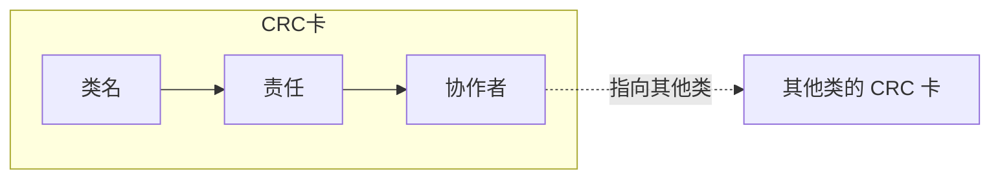

**建立系统分析模型的四步（答卷默写版）**：

| 步 | **答卷表述** | 是否属 CRC |
|----|--------------|------------|
| 1 | 定义概念类 | ✓ CRC |
| 2 | 确定类之间的关系 | ✓ CRC |
| 3 | 为类添加职责 | ✓ CRC |
| 4 | 建立交互图（如序列图），展现对象在流程中的动态协作 | ✗ CRC 之后 |

**口诀（助记）**：「先定类、再定关系、再加职责；CRC 三步完，交互图画动态。」

**CRC 与 BCE 怎么配合（答卷）**：CRC 用于找出类及其职责与协作；BCE 用于为分析类标注边界/控制/实体角色。二者互补：先 CRC 再贴 BCE，便于画序列图。

前端类比（非答卷）：CRC ≈ 便签列「模块名 / 负责啥 / 依赖谁」；BCE ≈ 再贴「页面 / 编排 / 数据」标签。

**别搞混（答卷对比句）**：

| 对比 | 可直接写的区别 |
|------|----------------|
| CRC vs 循环冗余校验 | OOA 中的 CRC 指类–责任–协作者建模；循环冗余校验是网络/存储检错码。 |
| CRC vs 用例建模 | 用例说明谁要什么功能；CRC 说明功能落到哪些类的职责与协作。 |
| 责任 vs 属性列表 | 责任描述行为与知识；仅抄属性名不等于写清责任。 |
| 协作者 vs 参与者 | 协作者是其他类；参与者是系统外的角色。 |

### 4.6 分析模型产物（OOA 交什么卷）

| 产物 | 回答的问题 | 与需求工程关系 |
|------|------------|----------------|
| **用例图 + 用例规约** | 谁要什么功能 | 直接进 SRS 功能需求 |
| **CRC 卡 / 概念类职责** | 类有哪些、谁负责什么、找谁协作 | 分析模型静态基础（常考四步前三） |
| **分析类图（BCE 草图）** | 哪些概念对象、谁协调 | 衔接 OOD，不做实现细节 |
| **序列图（关键场景）** | 一次用例里谁调谁 | 验证用例规约可实现；对应四步之四 |
| **状态机图（若需要）** | 单个对象状态迁移 | 与 STD 视角一致，UML notation |
| **领域概念类图** | 名词有哪些、关联多重性 | 非 BCE，偏领域模型；常与 CRC 第 1–2 步同步 |

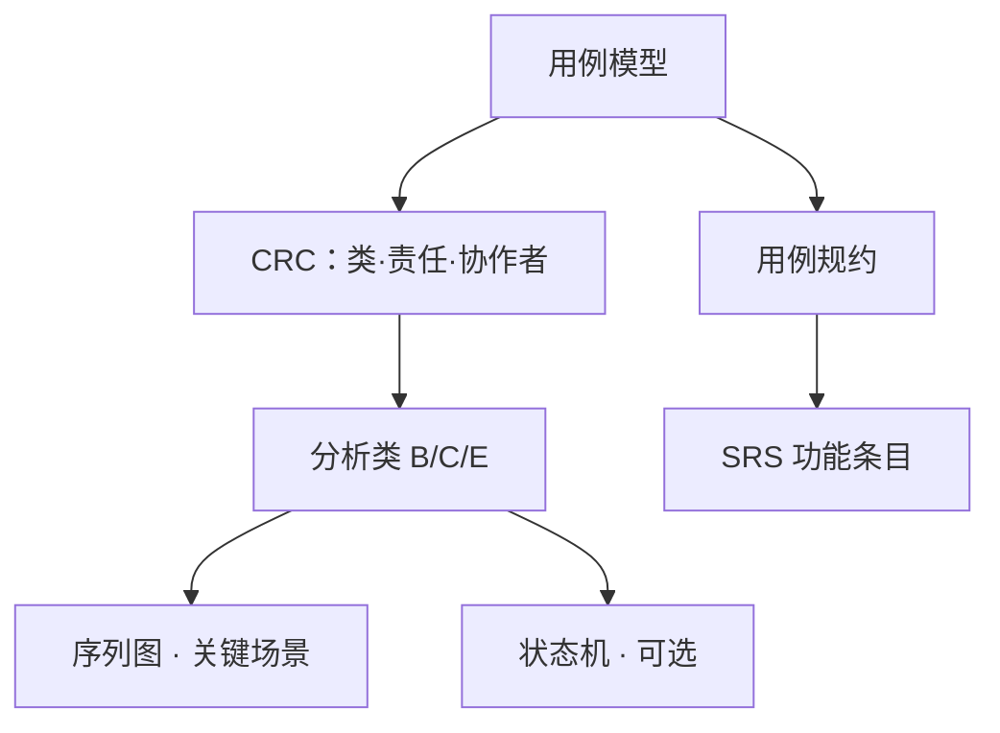

**OOA vs OOD**（再次钉死）：

| | OOA 分析 | OOD 设计 |
|--|----------|----------|
| 问题 | 做什么 | 怎么做 |
| 类 | 分析类、领域概念、CRC 职责 | 设计类、接口、模式 |
| 细节 | 无数据库表、无具体 API 路径 | 有模块、组件、部署 |

### 4.7 L3 自测

- [ ] 能默写「系统分析建模」定义与作用完整句  
- [ ] 能默写 OO 建立系统分析模型四步，并指出前三步=CRC  
- [ ] 用例构建四步  
- [ ] 主事件流与备选各举一例  
- [ ] 「登录界面类」属于 B/C/E 哪一类？  
- [ ] 分析类 B/C/E：**能默写答卷完整句**（定义「X 是…」+ 作用「用于…」）  
- [ ] 能默写「采用 BCE 的作用」一整段  
- [ ] CRC 三栏各写什么  
- [ ] include 与 extend 箭头方向（不会的回去看 UML 指南）

---

## 5. L4 · 面：对比、案例套路与 UML 五图衔接

### 5.1 SA 与 OOA 对照总表

| 维度 | 结构化 SA | 面向对象 OOA |
|------|-----------|--------------|
| 基本单元 | 加工、数据流 | 对象、用例、类 |
| 核心图 | DFD、STD | 用例图、类图、序列图… |
| 文字配套 | **数据字典** | **用例规约** |
| 分解方式 | 自顶向下**功能分解** | 识别对象/职责（**CRC**）与边界 |
| 状态 | STD | UML 状态机图 |
| 适合 | 数据流明显、事务处理 | 交互复杂、需求易变 |
| 需求跟踪 | 加工编号、字典条目 | 用例编号 UC-xxx |

**不是二选一**：同一项目可先 DFD 理清数据，再用例理清角色功能；论文可写「需求分析阶段采用用例+DFD 互补建模」。

### 5.2 题干信号 → 选 SA 还是 OOA、选哪张图

| 题干信号 | 优先工具 / 图 |
|----------|---------------|
| 分层 DFD、守恒、改错、0 层图 | **SA · DFD** |
| 数据元素定义、 `{}` `[]` 符号 | **数据字典** |
| 订单状态、设备运行/停止 | **STD 或 UML 状态图** |
| 角色、功能目标、系统边界 | **用例图** |
| 类有哪些、职责、找谁协作 | **CRC 卡** → 概念/分析类图 |
| 一次交互里消息顺序 | **序列图 / 协作图**（分析模型第四步） |
| 类、属性、关联、多重性 | **类图** |
| 调用顺序、消息、场景 | **序列图** |
| 业务流程、并行审批 | **活动图**（非 DFD） |
| TFD、业务流水、部门间单据 | **业务流程图**（第10章，**不是 DFD**） |

**TFD vs DFD**（案例常混）：

| | TFD 业务流程图 | DFD 数据流图 |
|--|----------------|--------------|
| 符号数 | 6 种 | **4 种** |
| 视角 | 部门间业务「谁传给谁」 | 系统功能与数据存储 |
| 内部实体 | 有（参与处理） | 系统内只有加工，外只有外部实体 |

### 5.3 案例填空四步（SA + OOA 通用）

1. **圈题干名词**——角色、单据、表、状态、动作  
2. **定空白语义**——是外部实体、加工、用例还是类？  
3. **核对规则**——DFD 动宾 / 平衡；include 基→被含 / extend 扩展→基  
4. **用题干原词填**——别自造与案例无关的名字  

**DFD 改错扫描顺序**：控制流 → 命名 → 存储读写 → 父子平衡 → 内外实体混用  

**用例填空扫描顺序**：边界外=参与者 → 椭圆=用例动宾 → 虚线=include/extend → 编号跟踪  

### 5.4 与 UML 必考五图的衔接

需求分析（OOA）完成后，设计前常具备以下视图；与 `UML-体系化学习指南` L2 一一对应：

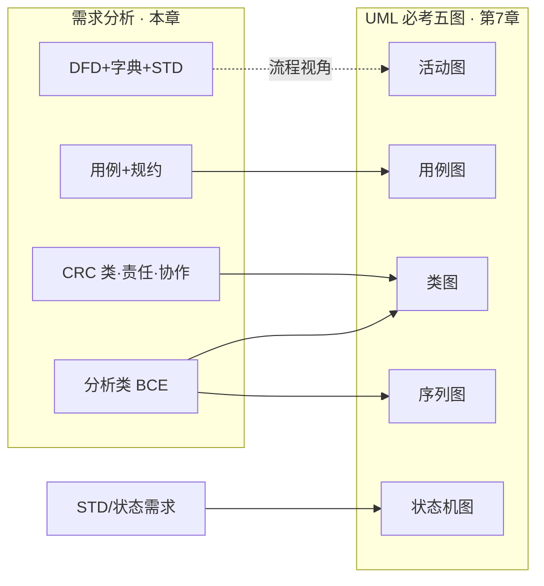

| 分析产物 | 延伸到 UML | 说明 |
|----------|------------|------|
| 用例模型 | **用例图** | 同一张，符号规范化 |
| CRC / 概念类职责 | **类图** | 先类–责任–协作，再补属性关联 |
| 分析类 BCE | **类图** | 加属性/操作/关联 |
| 用例场景 | **序列图** | 按主事件流画消息；分析模型第 4 步 |
| STD / 状态需求 | **状态机图** | 对象级生命周期 |
| 业务过程（非纯数据流） | **活动图** | 并行、泳道 |

**4+1 视图钩子**（架构题）：用例视图 ← 用例图；逻辑视图 ← 类图；进程视图 ← 序列/活动；实现 ← 组件；物理 ← 部署。需求分析主要喂饱**用例视图 + 逻辑视图**。

### 5.5 OOA → OOD → 实现 链条（与后续章节）

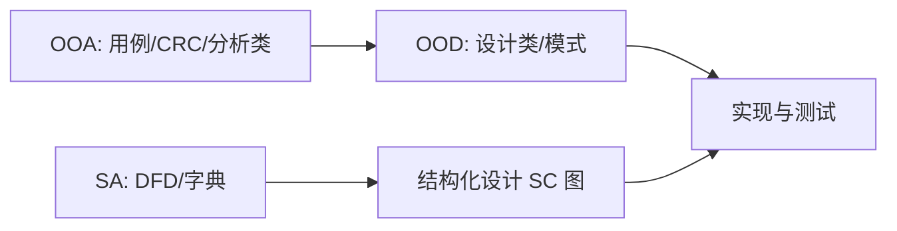

### 5.6 L4 限时自测清单

合上书 30 秒能答：

- [ ] DFD 四要素 + 六条绘制规则  
- [ ] 字典六类 + `{}` `[]` `*`  
- [ ] 平衡原则 + 三条守恒  
- [ ] 用例四构建步 + 规约字段  
- [ ] 系统分析建模：定义 + 作用完整句  
- [ ] 分析类 B/C/E：**能默写答卷完整句**（定义「X 是…」+ 作用「用于…」）  
- [ ] 能默写「采用 BCE 的作用」一整段  
- [ ] 边界/控制/实体判题信号（界面 / 编排 / 业务名词）  
- [ ] CRC 三栏 + 分析模型四步（前三步=CRC）  
- [ ] SA vs OOA 五维对比  
- [ ] TFD vs DFD 一眼辨  

---

## 6. 从点到面：综合串题（自测）

1. 同一「网上书店」：写出 0 层 DFD 应有哪些外部实体；再写 2 个系统用例名。  
2. 父图加工「结算」有输入「购物车、优惠券」、输出「订单、扣款结果」——子图少「优惠券」输入，错在哪？  
3. 「处理信息」应改成什么加工名？  
4. 「客户退货」是业务用例还是系统用例？「生成退货单」呢？  
5. 登录用例：主事件流 3 步、备选 1 条（密码错误）各写什么？  
6. 「订单界面」「订单服务编排」「订单实体」分别对应 B/C/E？  
7. 建立分析模型四步是什么？哪三步叫 CRC？CRC 三栏写什么？  
8. 题干「数据流守恒、分层改错」→ 选 SA 还是 OOA？用哪张图？  
9. 题干「参与者、include 身份认证」→ 填什么类型的 UML 元素？

做完 L0–L4 问答后，用案例分析 **需求** / **规划** 领域练限时卷。

---

## 7. 迷你练习

**A · DFD**  
网上报修：用户提交报修单，调度员派工，维修员回填结果，系统存「工单库」。  
在纸上画 0 层 + 1 层（至少 2 个加工、1 个存储），检查加工是否动宾、存储是否读写。

**B · 字典**  
用 `{}` `+` 写「报修单 = 单号 + 报修人 + [电话|邮箱] + 故障描述」。

**C · 用例**  
同一报修系统：列 2 参与者、3 用例；「派工」是否 include「查询空闲维修员」？（是 → include）

**C2 · CRC**  
为「工单」「调度员界面」「派工控制」各写一张 CRC 卡（类/责任/协作者）；指出哪张偏 B/C/E。  
默写：分析模型四步；圈出属于 CRC 的前三步。

**D · 改错**  
DFD 中「数据库」作为外部实体、加工名为「数据」、存储只有写入——各改一处。

**要点**：D 外部实体改「维修员/用户」；加工改「登记报修」；存储补「读取工单」流。

---

## 8. 易混速查

| 对比 | A | B |
|------|---|---|
| DFD vs 数据字典 | 图形分解 | 文字精确定义 |
| DFD vs 流程图/活动图 | 仅数据流四要素 | 可有控制流/泳道/并行 |
| 逻辑 vs 物理 DFD | 抽象功能 | 含实现介质 |
| 0 层 vs 1 层 | 系统整体对外 | 系统内部首次分解 |
| STD vs UML 状态图 | SA 传统 | OOA/UML  notation |
| 业务用例 vs 系统用例 | 组织目标 | 软件边界内 |
| 用例 vs 用例步骤 | 椭圆一级功能 | 规约里的 1、2、3 步 |
| 主事件流 vs 备选 | 成功路径 | 失败/分支 |
| OOA vs OOD | 做什么 | 怎么做 |
| 系统分析建模 vs 系统设计建模 | 澄清「做什么」、产出分析模型 | 决定「怎么做」、产出设计方案 |
| 分析类 vs 设计类 | B/C/E 临时职责标签 | 实现级接口与模式 |
| 边界类 vs 参与者 | 系统内交互接口 | 系统外角色 |
| 控制类 vs 实体类 | 编排流程 | 业务数据与规则 |
| CRC vs BCE | 卡片手法找类与协作 | 给分析类贴 B/C/E 角色 |
| CRC 建模 vs 循环冗余校验 | 类–责任–协作者（OOA） | 网络/存储检错码 |
| 分析模型前三步 vs 第四步 | CRC（类/关系/职责） | 交互图（动态消息） |
| TFD vs DFD | 业务流水 6 符号 | 系统数据流 4 符号 |

---

## 9. 资源索引

| 资源 | 路径/入口 |
|------|-----------|
| 章节精炼 | `第二篇-关键技术/第11章-软件需求工程.md` §四–§五 |
| DFD 规则加深 | `第二篇-关键技术/第10章-系统规划与分析.md` §四 |
| 用例符号与五图 | `速查/UML-体系化学习指南.md` |
| 需求工程总路径 | `速查/需求工程-体系化学习路径.md`（L3 建模与本章重叠，本路径专精 SA+OOA） |
| 范式对比 | `速查/高频对比速查表.md` · 结构化 vs OO |
| 大纲对照 | `速查/大纲考点对照.md` §9.4–9.5 |
| 选择题路径 | 刷题 · **结构化与OO分析（L0→L4）**（含出题工坊 CRC/BCE 加练） |
| 工坊批次 | `content/workshop/new/20260913-CRC与BCE加练.jsonl` |
| 案例加练 | 案例分析 · 领域=需求 或 规划 |

站点知识点页已支持 **Mermaid 图形渲染**；ASCII 图无需外网亦可阅读。

---

## 10. 规范说明

- **定义 / 作用写作准则（强制）**：凡「定义」「作用」须写成可直接用于案例/简答得分的完整句——定义用「X 是……」，作用用「用于…… / 主要作用是……」；口诀与前端类比仅助记，不得当作答卷正文。见 §0.1。  
- 结构化部分对齐教程第11章 §11.4 及第10章 DFD 绘制规则；面向对象部分对齐 §11.5 与 UML 2.5.1 用例/分析类惯例；**CRC 建模**对齐案例分析「建立分析模型」标准步骤表述。  
- 软考语境下「STD」「状态转换图」与「UML 状态机图」可能交替出现，按题干关键词（SA/DFD vs UML/OOA）选用表述即可。  
- OOA 题干出现 **CRC** 时，默认指 **Class-Responsibility-Collaborator**，不是循环冗余校验。  
- 本文不替代 SRS 编写与需求管理（见《需求工程-体系化学习路径》L4）。
