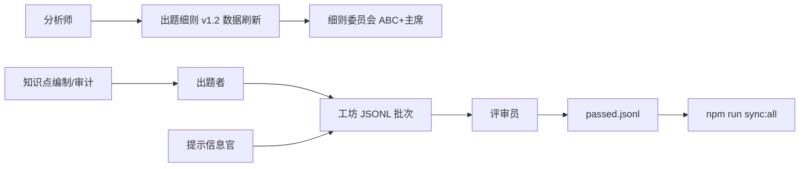

# 非真题重编重组工程计划（2026-09-24）

> **发起人**：用户「组织全部人，分析真题，重编非真题」  
> **总协调**：题库网站 PM + 出题工坊主席（流程）  
> **原则**：规律来自真题；内容原创；分批可验收；禁止静默改库不发版。

## 0. 范围

| 类别 | 路径 | 题量/规模 | 本计划 |
|------|------|-----------|--------|
| 上午自编 | `content/banks/practice/all.jsonl` | **730** | ✅ **全部阶段完工**（见完工报告） |
| 上午工坊 | `content/workshop/new/*.jsonl` | ~165（sync 合并） | Phase B 随批次 passed |
| 案例自编 | `content/banks/cases/` + MD 源 | ~130 | Phase D（未启动） |
| 论文自编 | `content/banks/paper/all.jsonl` | 少量 | Phase D（未启动） |
| 上午真题 | `content/banks/real/**` | 1040 | **只读**，供分析 |

## 1. 组织与职责



| 角色 | Skill | 交付物 |
|------|-------|--------|
| 分析师 | sysanalyst-analyst | `真题规律分析-2026-09-24.md`、JSON 统计 |
| 细则委员会 | committee-a/b/c + chair | v1.2 表决、`出题细则报告.md` §2 刷新 |
| 出题者 | sysanalyst-setter | 分章重写 JSONL、`content/workshop/new/` |
| 评审员 | sysanalyst-reviewer | 批次审计记录、驳回清单 |
| 提示信息官 | sysanalyst-hint-officer | 解析 ≥35 字、错因提示 |
| 网站 QA | sysanalyst-web-qa | sync 后冒烟、随机 75 题配额 |

## 2. 阶段划分

### Phase A — 元数据重组（**2026-09-24 已完成**）

- 脚本：`scripts/reorganize-practice-bank.mjs --write`
- 动作：按真题长度/情景启发式重标 `style_track`；统一 `bank=practice`；补 `intensity`/`difficulty`；写入 `reorganized_pass=meta-v1`
- 审计：`content/banks/practice/reorg-audit-2026-09-24.json`（**283** 条 style 变更；**119** 条待扩写解析）
- **未改**：题干、选项、答案正文

### Phase B — 内容重编（分批，约 4–6 周）

| 批次 | 优先级 | 题量 | 验收 |
|------|--------|------|------|
| B1 | 解析 &lt;35 字 | 119 | ✅ 脚本扩写完成；待 10% 抽检 + 发版 |
| B2 | 第 11 章需求/SAO | 150 | ✅ 141 题干情景化；scenario 76/150；待抽检 |
| B3/B4 | 全章 + 工坊 | 730+145 | ✅ 情景化 + 再平衡 short 20% |
| B4 配额 | style 轨 | — | short 146 / scenario 584 |

产出：`workshop/new/重编-20260924-批次*.jsonl` → 评审 → `*-passed.jsonl` → 回写 practice 或仅 workshop bank。

### Phase C — 细则数据刷新 ✅

- `出题细则报告.md` §2.1/§2.5 已与 1040 真题、730 自编对齐
- v1.2 正式签章仍走委员会目录（数据已就绪）

### Phase D — 下午案例/论文 ✅

- 130 案例 / 13 论文：结构已符合情景案例体，仅加 `reorganized_pass=phase-D-audit-ok`

## 3. 质量门禁（每批）

1. §7 出题 checklist 全勾  
2. §8 评审 checklist；模板题干 ≤30%  
3. `npm run sync:all` + 站点随机 75 题无异常  
4. 发版：`package.json` + `release-notes.json` + `npm run check:release`

## 4. 当前差距（相对真题全库 n=1040）

| 维度 | 真题（全库） | 自编（meta-v1 后） |
|------|--------------|-------------------|
| 机考 short ≤50 字 | 38.1% | 404/730 **55.3%**（仍偏高，靠 B 批加长情景题下调） |
| scenario 轨 | ~38.8% 关键词 | 246/730 **33.7%**（已提升，目标 ~40%） |
| 解析 &lt;35 字 | — | **119**（须清零） |
| 模板「下列说法正确的是」 | — | **1**（可保留为监控项） |

## 5. 命令速查

```bash
node scripts/analyze-real-patterns.mjs
node scripts/reorganize-practice-bank.mjs          # dry-run
node scripts/reorganize-practice-bank.mjs --write  # 写回 practice
npm run sync:all
npm run check:release
```

---

**状态**：✅ **工程闭环**（2026-09-24）· 详见 `非真题重编重组-完工报告-2026-09-24.md` · `npm run validate:reorg`
